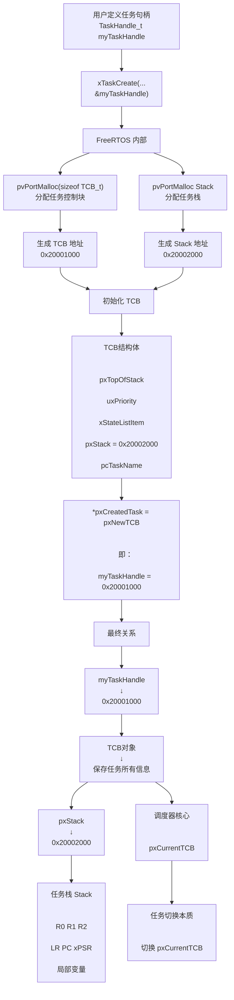

## 学习路线

```
🥇 第一层（必须吃透）
✔ Task
✔ Queue
✔ Semaphore/Mutex
🥈 第二层（工程核心）
✔ EventGroup
✔ 软件定时器
🥉 第三层（高级）
✔ StreamBuffer
✔ MessageBuffer
✔ QueueSet
```


## 一.代码编程风格


### 数据类型以及文件前缀定义

**通用宏定义：**


- 针对不同类型进行了标准化接口宏定义，以 **`portCHAR`** 为例，他实际代表的就是 **`char`** 的意思，而 `port` 就是接口的意思。
- 移植系统的通用性解释：
  - `#define portSTACK_TYPE uint32_t` ：这里是在32位的MCU上，栈的单位必须是 32-bit，按照四字节对齐，同时对于寄存器压入栈(push)/栈弹出到寄存器(pop)操作也必须是 32-bit 操作，假设你改成 16 - bit，即 uint16_t 的类型，那么寄存器操作就会完全错乱，后续移植到其他位的单片机，直接修改该文件更快捷，**和底层硬件/编译器解耦**
  - **所以这些定义是为了跨平台统一方便修改，但是并不是要求应用层使用类似于 `portCHAR cBuffer[10]` 这种写法，应用层仍然是使用 `char cBuffer[10]` 这种写法** 

**各种定义前缀：增强可读性和标识性：**

- 基础类型前缀（c / s / l / u）

| 前缀 | 含义     | 对应类型           | 示例          | 说明           |
| ---- | -------- | ------------------ | ------------- | -------------- |
| c    | char     | int8_t / char      | `cCharacter`  | 8位字符/小数据 |
| s    | short    | int16_t            | `sShortValue` | 16位数据       |
| l    | long     | int32_t / uint32_t | `lLongNumber` | 32位数据       |
| u    | unsigned | 无符号修饰         | `uValue`      | 单独不常用     |

------

- 组合类型（最常见）

| 前缀 | 含义             | 示例          | 说明       |
| ---- | ---------------- | ------------- | ---------- |
| uc   | unsigned char    | `ucValue`     | 8位无符号  |
| us   | unsigned short   | `usLength`    | 16位无符号 |
| ul   | unsigned long    | `ulCount`     | 32位无符号 |
| pc   | pointer to char  | `pcBuffer`    | 字符串指针 |
| ps   | pointer to short | `psValue`     | short指针  |
| pv   | pointer to void  | `pvParameter` | 通用指针   |

------

- 核心前缀（重点）可以组合使用，比如说还可以是 **`px`** 前缀代表指向某个地址的指针

| 前缀 | 含义                      | 示例                     | 用途           |
| ---- | ------------------------- | ------------------------ | -------------- |
| x    | FreeRTOS内核对象 / 返回值 | `xTaskCreate` / `xQueue` | 任务/队列/句柄 |
| v    | void函数                  | `vTaskDelay`             | 无返回值函数   |
| p    | pointer                   | `pvPortMalloc`           | 指针类型       |
| t    | type                      | `TaskHandle_t`           | 类型定义       |

------

- 关键RTOS类型

| 类型        | 本质           | 对应C类型                | 说明        |
| ----------- | -------------- | ------------------------ | ----------- |
| BaseType_t  | 基础返回类型   | long / int32_t           | API返回值   |
| UBaseType_t | 无符号基础类型 | unsigned long / uint32_t | 优先级/计数 |
| TickType_t  | 系统tick类型   | uint32_t                 | 系统时间    |

------

- 典型示例（STM32 FreeRTOS）

| 代码         | 含义                      |
| ------------ | ------------------------- |
| ucQueueSize  | 队列大小（unsigned char） |
| usStackDepth | 任务栈深度                |
| ulTaskNumber | 任务编号                  |
| pcName       | 字符串指针                |
| pvParameters | 通用参数指针              |
| xTaskHandle  | 任务句柄                  |
| xQueue       | 队列句柄                  |
| xResult      | 返回值                    |


### 代码风格定义（HAL封装与原生RTOS）

**RTOS原生风格和HAL库CMSIS封装区分：**

- **HAL库代码：**

- ```c
  // 任务句柄变量 
  osThreadId xLED_ONHandle;   
  
  // 定义任务的属性(名字，函数，优先级，栈大小)
  osThreadDef(LED_ON, StartLED_ON, osPriorityBelowNormal, 0, 128);
  // 创建任务(通过osThread拿到定义好的任务属性，同时可以传入参数，这里是NULL)，将任务传入 LED_ONHandle句柄
  xLED_ONHandle = osThreadCreate(osThread(LED_ON), NULL);
  ```

  - 根据 `osThreadDef` 和  `osThreadCreate` 的源代码分析

  - ```c
    // osThreadDef
    #if( configSUPPORT_STATIC_ALLOCATION == 1 )
    #define osThreadDef(name, thread, priority, instances, stacksz)  \
    const osThreadDef_t os_thread_def_##name = \
    { #name, (thread), (priority), (instances), (stacksz), NULL, NULL }
    
    #define osThreadStaticDef(name, thread, priority, instances, stacksz, buffer, control)  \
    const osThreadDef_t os_thread_def_##name = \
    { #name, (thread), (priority), (instances), (stacksz), (buffer), (control) }
    #else //configSUPPORT_STATIC_ALLOCATION == 0
    
    #define osThreadDef(name, thread, priority, instances, stacksz)  \
    const osThreadDef_t os_thread_def_##name = \
    { #name, (thread), (priority), (instances), (stacksz)}
    #endif
    
    // osThreadCreate
    osThreadId osThreadCreate (const osThreadDef_t *thread_def, void *argument)
    {
      TaskHandle_t handle;
      
    #if( configSUPPORT_STATIC_ALLOCATION == 1 ) &&  ( configSUPPORT_DYNAMIC_ALLOCATION == 1 )
      if((thread_def->buffer != NULL) && (thread_def->controlblock != NULL)) {
        handle = xTaskCreateStatic((TaskFunction_t)thread_def->pthread,(const portCHAR *)thread_def->name,
                  thread_def->stacksize, argument, makeFreeRtosPriority(thread_def->tpriority),
                  thread_def->buffer, thread_def->controlblock);
      }
      else {
        if (xTaskCreate((TaskFunction_t)thread_def->pthread,(const portCHAR *)thread_def->name,
                  thread_def->stacksize, argument, makeFreeRtosPriority(thread_def->tpriority),
                  &handle) != pdPASS)  {
          return NULL;
        } 
      }
    #elif( configSUPPORT_STATIC_ALLOCATION == 1 )
    
        handle = xTaskCreateStatic((TaskFunction_t)thread_def->pthread,(const portCHAR *)thread_def->name,
                  thread_def->stacksize, argument, makeFreeRtosPriority(thread_def->tpriority),
                  thread_def->buffer, thread_def->controlblock);
    #else
      if (xTaskCreate((TaskFunction_t)thread_def->pthread,(const portCHAR *)thread_def->name,
                       thread_def->stacksize, argument, makeFreeRtosPriority(thread_def->tpriority),
                       &handle) != pdPASS)  {
        return NULL;
      }     
    #endif
      
      return handle;
    }
    
    ```

  - **`osThreadDef`** 的本质是将任务信息写入一个结构体，然后再通过 **`osThreadCreate`** 将结构体的任务信息用来创建任务句柄，**`osThreadCreate`** 的核心仍然是调用 **`xTaskCreate或者xTaskCreateStatic`** 这种RTOS原生风格创建API

- **转换为RTOS原生风格：**

- ```c
  TaskHandle_t xLED_ONHandle;  // 任务句柄变量
  
  xTaskCreate(
      StartLED_ON,        // 任务函数
      "LED_ON",           // 任务名字
      128,                // 栈大小
      NULL,               // 传入参数
      osPriorityBelowNormal,             // 优先级（这里可以直接调用HAL库封装的，或者你自己传入数字也行）
      &xLED_ONHandle   // 任务句柄（存身份证）
  );
  ```

- **`osThreadId`** 和 **`TaskHandle_t`** 是对等关系，都可以用来创建任务句柄，而 **`xTaskCreate`** 在HAL库里面被拆成了两段，先用 **`osThreadDef` 来写入任务信息，然后调用 `osThreadCreate` 来创建任务** 。

  

### 各个文件作用（开发速查）

- **Kernel 核心文件（最重要）**

| 文件             | 作用               | 理解                 |
| ---------------- | ------------------ | -------------------- |
| task.c           | 任务管理           | 创建/删除/调度任务   |
| queue.c          | 队列/信号量/互斥锁 | 任务间通信核心       |
| list.c           | 链表实现           | 调度器底层数据结构   |
| timers.c         | 软件定时器         | 延时/周期回调任务    |
| event_groups.c   | 事件组             | 多条件同步（位标志） |
| stream_buffer.c  | 流缓冲区           | 字节流通信（轻量）   |
| message_buffer.c | 消息缓冲区         | 带边界的数据通信     |

------

- **Port 移植层（STM32核心）**

| 文件        | 作用           | 理解                      |
| ----------- | -------------- | ------------------------- |
| port.c      | 上下文切换实现 | CPU任务切换核心（PendSV） |
| portmacro.h | 移植宏定义     | 类型/中断控制/架构适配    |

------

- **Heap 内存管理（动态内存）**

| 文件     | 作用             | 特点        |
| -------- | ---------------- | ----------- |
| heap_1.c | 只分配不释放     | 最简单      |
| heap_2.c | 可释放（易碎片） | 老方案      |
| heap_3.c | 调用malloc       | 依赖系统    |
| heap_4.c | 防碎片（最常用） | 推荐STM32用 |
| heap_5.c | 多段内存         | 复杂系统    |

------

- **API 头文件（开发接口）**

| 文件           | 作用      | 理解                     |
| -------------- | --------- | ------------------------ |
| FreeRTOS.h     | 总入口    | 所有API统一头            |
| task.h         | 任务API   | xTaskCreate / vTaskDelay |
| queue.h        | 队列API   | 消息/同步                |
| semphr.h       | 信号量    | 互斥锁/同步              |
| timers.h       | 定时器API | 软件定时器               |
| event_groups.h | 事件组API | 位同步                   |

------

- **STM32启动相关（CubeMX常见）**

| 文件/模块       | 作用           | 说明       |
| --------------- | -------------- | ---------- |
| freertos.c      | 任务创建入口   | CubeMX生成 |
| main.c          | 主函数         | 启动调度器 |
| SysTick_Handler | 系统节拍       | 1ms tick   |
| PendSV_Handler  | 任务切换       | 最关键中断 |
| SVC_Handler     | 启动第一个任务 | 启动调度   |


## 二.根据任务创建函数理清底层脉络

### 核心函数(xTaskCreate)

```c
// 任务创建底层函数
BaseType_t xTaskCreate(	TaskFunction_t pxTaskCode,                    // pxTaskCode:写的任务函数
						const char * const pcName,                   // 任务函数名称
						const configSTACK_DEPTH_TYPE usStackDepth,  // 任务栈大小
						void * const pvParameters,				   // 传入任务的参数指针
						UBaseType_t uxPriority,                   // 任务优先级
						TaskHandle_t * const pxCreatedTask ) // 返回的任务句柄(实际就是TCB指针指向TCB控制块地址)
	{
	TCB_t *pxNewTCB;     // 实例化TCB指针
	BaseType_t xReturn;  // 存储返回值

		/* 根据栈生长方向，决定先分配栈还是先分配 TCB，防止栈覆盖 TCB，ARM默认栈向下生长 */
		#if( portSTACK_GROWTH > 0 )  // 栈向上生长的情况，// 在ARM单片机中忽略
		{
			pxNewTCB = ( TCB_t * ) pvPortMalloc( sizeof( TCB_t ) );// 在ARM单片机中忽略
			if( pxNewTCB != NULL )						    	  // 在ARM单片机中忽略
			{
				pxNewTCB->pxStack = ( StackType_t * ) pvPortMalloc( ( ( ( size_t ) usStackDepth ) * sizeof( StackType_t ) ) ); 									    	// 在ARM单片机中忽略
				if( pxNewTCB->pxStack == NULL )	           // 在ARM单片机中忽略
				{					
					vPortFree( pxNewTCB );			     // 在ARM单片机中忽略
					pxNewTCB = NULL;				    // 在ARM单片机中忽略
				}									   // 在ARM单片机中忽略
			}                                         // 在ARM单片机中忽略
		}                                            // 在ARM单片机中忽略
		#else /* portSTACK_GROWTH */    // 栈向下生长的情况下适配ARM单片机，不可忽略
		{
		StackType_t *pxStack;			// 先分配栈内存			 ，
			//分配栈空间内存  usStackDepth是堆栈深度即堆栈大小
			pxStack = pvPortMalloc( ( ( ( size_t ) usStackDepth ) * sizeof( StackType_t ) ) ); 

			if( pxStack != NULL )
			{
				// 在先申请好栈空间的情况下再申请TCB空间，malloc返回通用指针，这里要强制转化为TCB_t *的指针格式
                /*TCB_t本身是TCB结构体的一个实例化，现在分配了内存地址，这个内存地址里面就放入了这个实例化的结构体
                 那么TCB_t * 就代表这个地址，并且也将地址给到了pxNewTCB    */
				pxNewTCB = ( TCB_t * ) pvPortMalloc( sizeof( TCB_t ) );

				if( pxNewTCB != NULL )
				{
					/* 把栈地址存进 TCB 结构体  */
					pxNewTCB->pxStack = pxStack;
				}
				else
				{
					/* 释放栈空间 */
					vPortFree( pxStack );
				}
			}
			else
			{
				pxNewTCB = NULL;
			}
		}
		#endif 
	    
        // 如果 TCB 和栈都申请成功
		if( pxNewTCB != NULL )
		{
			#if( tskSTATIC_AND_DYNAMIC_ALLOCATION_POSSIBLE != 0 ) /*lint !e9029 !e731 Macro has been consolidated for readability reasons. */
			{
				/* 标记这个任务是动态申请内存的，tskDYNAMICALLY_ALLOCATED_STACK_AND_TCB是Freertos特定的标记变量 */
				pxNewTCB->ucStaticallyAllocated = tskDYNAMICALLY_ALLOCATED_STACK_AND_TCB;
			}
			#endif /* tskSTATIC_AND_DYNAMIC_ALLOCATION_POSSIBLE */
			
            // 初始化新任务，把函数、优先级、栈、名称等全部写入 TCB（核心函数）
			prvInitialiseNewTask( pxTaskCode, pcName, ( uint32_t ) usStackDepth, pvParameters, uxPriority, pxCreatedTask, pxNewTCB, NULL );
            // 把任务加入就绪队列 
			prvAddNewTaskToReadyList( pxNewTCB );
            // 返回值设置 pdPASS,表示任务创建成功
			xReturn = pdPASS;
		}
		else
		{	// 申请失败就返回这特定标签变量
			xReturn = errCOULD_NOT_ALLOCATE_REQUIRED_MEMORY;
		}

		return xReturn;
	}
```

- **`TaskHandle_t * const pxCreatedTask`** 双重指针如何理解？
  - **`myTaskHandle`**本身就是一个指针，这个指针的地址传入进来，解引用得到指针变量本身，然后通过函数内部来修改这个指针变量本身，让他指向TCB结构体
  - **`const`** 固定了地址，函数内部无法改变地址
  - **`*pxCreatedTask`** 则对这个地址进行了解引用，代表了 **`myTaskHandle`** 本身

- 函数内部顺序图快速游览

- ```
  xTaskCreate
    ↓
  1. 分配内存：TCB + 栈
    ↓
  2. 失败 → 返回错误
    ↓
  3. 成功 → prvInitialiseNewTask（填 TCB）
    ↓
  4. prvAddNewTaskToReadyList（就绪）（内部依靠pxCurrentTCB指针去选择不同任务）
    ↓
  创建完成
  ```


#### 分析函数内部逻辑可以解决的工程调试问题

- **任务创建失败、创建后完全不运行**
  - 查看是不是 `pvPortMalloc` 申请内存失败
  -  是否是TCB 或栈没分配成功，以及分配顺序是否错了(ARM架构)
  - 是否栈空间配置太小无法运行
- **运行一段时间莫名死机、程序跑飞**
  - 抓取栈的数据，看是否溢出了
- **多任务下个别任务卡死、调度异常**
  - 看 TCB 里的**状态列表项** ，分析任务为什么没有进入就绪队列
  - 看任务是否被阻塞、挂起、死等信号量
- **反复创建删除任务引发系统崩溃**
  - 先看 TCB 和栈是动态申请还是静态申请的
  - 动态申请过程中删任务必须释放内存
- **删除任务后系统稳定性下降、偶发崩溃**
  - TCB 和栈内存是否完整释放、有无野指针残留

##### 问题排查思路：

1. **先定性现象，缩小范围**

- 上电直接死机 / 运行片刻死机 / 随机偶发死机
- 所有任务都不跑 / 单个任务卡死 / 高优先级任务抢占异常
- 频繁创建删除任务后崩溃

2. **第一步：核查任务创建本身**

对照`xTaskCreate`流程核对：

1. 查看函数返回值，判断是**内存分配失败**还是初始化失败
2. 核对栈深度配置，结合栈生长方向判断空间是否够用
3. 检查任务句柄是否正常生成，确认 TCB 结构体成功创建

3. **第二步：排查内存相关故障（对应源码内存申请逻辑）**

1. 系统总堆空间是否充足，多次创建任务是否耗尽堆内存
2. 动态分配的 TCB、任务栈，删除任务时是否正常释放，有无内存泄漏
3. 区分上下栈生长模式，是否存在栈内存覆盖 TCB 结构体的情况

4. **第三步：聚焦 TCB 核心成员，定位任务状态**

借助调试器查看 TCB 内部字段：

- `pxStack/pxTopOfStack`：判断栈是否溢出、栈现场是否被破坏
- 任务状态链表项：确认任务处于就绪 / 阻塞 / 挂起 / 运行哪种状态，为何脱离就绪队列
- `uxPriority`：核对优先级配置，排查优先级抢占引发的调度卡死
- 任务函数指针：是否指针异常导致跳转跑飞

5. **第四步：核查任务入队与调度**

1. 初始化后是否成功加入就绪链表，内核是否识别该任务
2. 同优先级、高低优先级任务之间的调度轮转是否正常
3. 有无代码意外把任务移出就绪队列

6. **第五步：回溯业务代码**

- 确认任务内部循环、延时、阻塞 API 使用是否合规，是否存在死循环、无限等待信号量等逻辑问题




​	


### 目前的知识缺口：

1. **任务切换底层原理（当前最大缺口）**

你只学会了**任务诞生**，还不懂**任务切换**

- 不清楚`PendSV`中断如何保存 / 恢复 TCB 里的栈现场
- 不了解时钟节拍如何触发任务调度
- 看不懂任务切换时寄存器、栈数据的变化，无法排查切换瞬间死机

2. **任务同步与互斥机制**

项目里几乎都会用到队列、信号量、互斥锁，这类问题极易引发死锁、卡死

- 不懂阻塞态、等待队列的工作逻辑
- 不会排查资源竞争、死锁、优先级翻转问题

3. **栈溢出、内存踩踏实战定位能力**

理论知道栈指针作用，但缺少实操手段：

- 不会借助 IDE 调试工具查看栈内存、统计栈使用率
- 无法精准定位哪段代码导致栈破坏、内存越界

4. **中断与任务联动逻辑**

工程里外设中断频繁和任务交互，中断处理不当会直接打乱任务调度

- 不清楚中断上下文、任务上下文的区别
- 不知道哪些 RTOS API 不能在中断里调用


## 三.任务优先级

| 对比维度 | FreeRTOS 任务优先级 (软件)          | 单片机硬件中断优先级 (硬件)              |
| -------- | ----------------------------------- | ---------------------------------------- |
| 管理者   | FreeRTOS 调度器（操作系统内核）     | NVIC（芯片内部的硬件中断控制器）         |
| 数值规律 | 数值越大，优先级越高                | 数值越小，优先级越高                     |
| 作用对象 | 软件任务（比如 LED 闪烁、数据解析） | 硬件事件（比如定时器溢出、串口收到数据） |
| 绝对规则 | 任务之间可以互相抢占                | 任何硬件中断都能随时打断任何任务         |


## 四.任务常用函数

-  **`vTaskDelete(TaskHandle_t xTaskToDelete);`**    **任务删除函数**

  - **删除：**任务控制块（TCB）、任务栈（Stack）、任务调度信息

  - **会保留句柄，所以删除后通常会将句柄赋值 NULL**  

  - 删除顺序

    1. 从调度器移除任务

    2. 从各种链表摘除

    3. 标记为待删除

    4. Idle任务回收内存

  - 代码示例：

  - ```c
    void StartALL_init(void const * argument)      // 只需要执行一次就自毁让出内存的任务
    {
      
      for(;;)
      {
        taskENTER_CRITICAL(); 			 // 进入临界区 无法被中断打断
        HAL_TIM_Base_Start_IT(&htim5);
        xSemaphoreGiveRecursive(RecursiveMutex_testHandle);
        taskEXIT_CRITICAL(); 			//退出临界区
        vTaskDelete(NULL);              // 执行完任务就删除自己任务       
      }
     
    }
    ```

  > 注意：这里传入的句柄参数如果是用于自定义文件，需要使用 **`extern osThreadId LED_ONHandle;`**  来调用外部C文件定义的句柄


-  **`vTaskDelay(pdMS_TO_TICKS(100));`**      **延时阻塞函数**，让任务进入阻塞态，让出CPU
  - **`pdMS_TO_TICKS(ms)`** 是一个宏定义，将 `ms` 转化为 `ticks` ，因为 **`vTaskDelay`** 函数传入参数必须是 `ticks` ，如果配置了 `configTICK_RATE_HZ` 为 1000，那么 1 个 Tick 就等于 1 毫秒。
  - 可以解决跨平台延时问题，不需要查阅 `configTICK_RATE_HZ` 宏的配置来计算每次延时的 `ticks` 
  - 此延时函数不会考虑业务逻辑时间，如果需要精准延时，则可以使用 **`vTaskDelayUntil()`** 函数
  - <u>**CPU计算时间依靠滴答数(ticks)**</u>


- **`BaseType_t xTaskAbortDelay( TaskHandle_t xTask );`**   **强制解除阻塞函数**  ，常应用于取消等待、超时处理
  - 该函数用于解除任务的阻塞状态，并使其进入就绪态随时会被任务调度器所调用
  - 传递参数可以选择NULL表示解除当前的任务的阻塞，选择指定运行任务的句柄则接触指定任务的阻塞
  - 返回值为 `BaseType_t` 类型(实际上是一种`long` 类型的值)的返回值，如果目标任务处于阻塞状态，则返回 `pdFAIL` ，如果目标任务没有处于阻塞状态，则返回 `pdPASS` ，可依据这个进行相应的处理。


- **`TickType_t xTaskGetTickCount()  ：`**       **滴答数获取函数，可以结合周期定时函数使用** 
  - 用于返回当前的滴答数(即当前系统所运行的时间)


-  **`void vTaskDelayUntil(TickType_t *pxPreviousWakeTime, TickType_t xTimeIncrement);`**     **周期定时函数** 

  - 允许任务按照固定的周期重复执行某个操作，基于绝对时间点计算延迟，而不是相对时间点，可以减少因任务执行时间差异导致的累积误差

  - 传递参数：

    - `TickType_t *pxPreviousWakeTime`：  
    - ` TickType_t xTimeIncrement` ：需要延时的滴答数， 依旧可以搭配 **`pdMS_TO_TICKS(ms)`** 宏来传入

  - 示例代码：

  - ```c
    void ControlTask(void *arg)
    {
        TickType_t xLastWakeTime = xTaskGetTickCount();           // 获取当前系统滴答数作为上一次的唤醒时间
        for(;;)
        {
            PID_Run();
            // 以上一次唤醒时间为基准延时，中间逻辑运算时间也包含了
            vTaskDelayUntil(&xLastWakeTime, pdMS_TO_TICKS(10));  
        }
    }
    ```

  - **周期任务冲撞如何处理？**

    -  周期任务延时时间一到，任务会进入就绪态，此时等待调度器依靠优先级来执行任务


- **`vTaskSuspend(TaskHandle_t xTaskToSuspend);`   **  **(任务挂起)** 

  - 用于将任务挂起，此时无法被调度器执行，直到通过  vTaskResume  函数将其恢复为止
    - 挂起不累积，如果你对同一个任务连续调用了 10 次 `vTaskSuspend`，**只需要调用 1 次** `vTaskResume` 就能把它恢复。它不像信号量那样需要一一对应
    - 在挂起一个任务前，一定要确保它**没有持有互斥锁（Mutex）或其他关键共享资源**。如果它拿着锁被挂起了，其他等待这个锁的任务就会无限期卡死，导致系统崩溃。
    - 绝对不能去挂起系统的空闲任务（Idle Task），否则会导致内存无法回收等严重问题。

  

- **`vTaskResume(TaskHandle_t xTaskToResume);`**    **取消任务挂起函数**

  - 用于将已经挂起的任务给恢复执行，一般前面的挂起任务通过 vTaskSuspend(NULL); 函数进行挂起后需要通过此函数进行取消，否则将一直处于挂起状态，同时此函数无法对 vTaskDelay 阻塞的效果产生影响。


- **`eTaskState eTaskGetState( TaskHandle_t xTask )  : `**      **获取任务状态函数**

  - ```
    直接返回枚举值来确定当前任务状态
    typedef enum
    {
        eRunning = 0,    
        eReady,           
        eBlocked,       
        eSuspended,        
        eDeleted,       
        eInvalid       
    } eTaskState;      
    ```

    

- **`void vTaskGetInfo( TaskHandle_t xTask, TaskStatus_t *pxTaskStatus, BaseType_t xGetFreeStackSpace, eTaskState eState );`**     获取<u>**单个**</u>任务的详细函数信息 

  - 传递参数：

  - **`xTask`** ：任务句柄

  - **`*pxTaskStatus`** ： 传入接收信息的结构体地址，前提你结构体要实例化

    - ```c
      typedef struct xTASK_STATUS
      {
          TaskHandle_t xHandle;             // 任务句柄：
          const char *pcTaskName;           // 任务名称
          UBaseType_t xTaskNumber;          // 任务编号：系统分配的唯一数字ID，即使任务重名也不会重复
          eTaskState eCurrentState;         // 当前任务状态：
          UBaseType_t uxCurrentPriority;    // 当前优先级：任务当前实际运行的优先级（若使用了互斥量，可能会因优先级继承而临时升高）
          UBaseType_t uxBasePriority;       // 基础优先级：创建任务时指定的原始优先级，不会随系统调度机制改变
          uint32_t ulRunTimeCounter;        // 累计运行时间：任务从创建至今占用的CPU总时间（需在FreeRTOSConfig.h中开启统计功能才有数据）
          StackType_t *pxStackBase;         // 堆栈基地址：任务栈在内存中的起始位置，底层调试用
          configSTACK_DEPTH_TYPE usStackHighWaterMark;     // 堆栈历史最小剩余值（高水位线）：记录栈空间“最危险”时还剩多少。越接近0，栈溢出风险越高
      } TaskStatus_t;
      
      TaskStatus_t TASKAStatus_t            // 实例化
      ```

  -  **`xGetFreeStackSpace`** ： 选填 **`pdFALSE`** 或者 **`pdTRUE`** ，是否计算堆栈剩余值，检查任务的堆栈剩余量，但是相对耗时

  - **`eState`**  ： 可以传入 **`eInvalid`** 选择查询当前任务状态，但是也可以直接传入当前任务的实际状态(你知道的情况下)，这样就无需查询了，速度更快，

    - 传入直接的状态需要是 **`eTaskState`** 的枚举类型，比如 **`eBlocked  `**  

  - <u>**`ulRunTimeCounter`参数正常情况下不能接收数据，需要额外配置函数和定时器进行打点技术，完整解决方案待定！！**</u> 
    - <u>目前可替代为 `vTaskGetRunTimeStats(char *)`  函数来通过返回任务运行的滴答数来解析当前任务的运行时间。</u>


-  **`vTaskGetRunTimeStats(char * )`**   : **获取所有任务运行时间以及CPU占用率函数**  ——只适合宏观查看，不方便使用数据

  - **函数需要进行前置配置：**

    1. **配置相关的宏，这里可以通过CubeMX里面便捷得配置 `Run time and task stats gatherting related definiton.`**

    2. **初始化一个用于测量任务运行时间得定时器，此定时器要求要比 `freertos` 的tick高10到20倍，通常配置20KHZ, 示例 PSC: 72-1  ARR 50-1 ，同时开启中断管理要求中断优先级大于5**   

    3. **定义一个变量用于追踪任务运行时间得滴答数**   

       - ```c
         volatile unsigned long long FreeRTOSRunTimeTicks = 0;  
         ```

    4. **`FreeRTOS`里面得 `FreeRTOSConfig.h` 文件里面定义了 两个函数** 

       - ```c
         \#define portCONFIGURE_TIMER_FOR_RUN_TIME_STATS configureTimerForRunTimeStats       
         \#define portGET_RUN_TIME_COUNTER_VALUE getRunTimeCounterValue          
         ```

       -  **`configureTimerForRunTimeStats`** ： 本身作为一个弱函数，可以改写，然后在里面开启中断以及时钟初始化，如果使用此函数，必须放在 main 函数得前面。

       - **`getRunTimeCounterValue`**  ： 本身也是一个弱函数，我们改写用来返回那个滴答计数值，即我们前面定义得**`FreeRTOSRunTimeTicks`** ，直接return 就可以，代表着返回当前的时间。

    5. **在 `main.c` 文件里面的 中断回调函数中，通过` if(htim -> Instance == TIM5) { FreeRTOSRunTimeTicks++ } `来进行运行速率的捕获，本身作为一个滴答数。**  

    6. **此时可以定义一个极大的数组 例如 `pcWriteBuffer[120] `，然后通过 `vTaskGetRunTimeStats(pcWriteBuffer); ` 来获取，此时可以直接通过 `printf` 来打印，它会返回任务的占用和运行时间。**


## 五.临界段和初始化顺序以及ISR版本函数(中断相关)

### 中断使用要求

- **`FreeRTIS`是在`SysTick`中断里面进行任务调度申请，其自动设置优先级为15。RTOS所能管理的最高优先级是5,小于5的优先级是无法得到管理的，比如1到4.**
- **由于中断总是会抢占任务执行，所以尽量减少中断的任务执行，防止被抢占的任务的执行时间。尽量简化ISR的功能，比如数据处理只是用来读取到缓冲区即可。**


### 临界段

- **原理**：**每次调用 taskENTER_CRITICAL() 都会增加一个内部计数器，记录当前进入临界区的次数，调用一次 taskEXIT_CRITICAL() 则相当于减少进入临界区的次数，而只有当 taskEXIT_CRITICAL()  被调用且计数器归零时，才会真正恢复中断状态。即你使用了 `taskENTER_CRITICAL()`  一定要使用 `taskEXIT_CRITICAL()`  ，否则中断永远无法恢复。**

  - **一个任务函数在执行时，可能会被其他高优先级的任务抢占CPU，也可能被任何一个中断的IST函数抢占CPU，而任务的某段代码必须连续执行完，不希望被其他任务或中断打断，这段代码称之为临界段。**

  - ```c
    taskENTER_CRITICAL();         开启临界代码段函数，可以嵌套定义
    /* 任务操作 */
    taskEXIT_CRITICAL();             结束临界代码段
    
    ```

- 嵌套使用：对于需要保护的模块都需要内部加入临界段保护，不同模块之间没有关系，只保护自己
  - 嵌套计数器内部逻辑：
    - `Func_A` 进入时，计数器变为 1（关中断）。
    - `Func_B` 进入时，计数器变为 2（保持关中断）。
    - `Func_B` 退出时，计数器减为 1（依然保持关中断，不会误开）。
    - `Func_A` 退出时，计数器减为 0（此时才真正开启中断）。


### 调度器和外设初始化顺序要求

**单片机正常初始化顺序：**`HAL_Init`  —>  `SystemClock_Config()` —> 外设初始化 —> RTOS初始化  —> 调度器启动

**问题：**  此时会遇到一个问题，如果在外设初始化阶段直接触发中断，进入了中断处理函数，这一步是在RTOS没有初始化完成的基础上进入了，内部任务代码一旦涉及RTOS，比如说使用带有ISR版本的函数，那么系统就会直接崩溃，死机。需要解决RTOS初始化优先顺序问题。（所有带有ISR版本的函数都需要在`FreeRTOS`完全初始化成功后才能使用，）

**解决方法：**    改变初始化顺序，将外设初始化以及相关使能单独作为一个任务，这个任务优先级最高，作为调度器启动后调用的第一个任务，任务执行后直接自毁。

**代码示例：**

```c
void StartALL_init(void const * argument)
{
  
  for(;;)
  {
    taskENTER_CRITICAL();  // 进入临界区 无法被中断打断
    MX_GPIO_Init();
    MX_USART1_UART_Init();
    HAL_TIM_Base_Start_IT(&htim5);
    xSemaphoreGiveRecursive(RecursiveMutex_testHandle);
    taskEXIT_CRITICAL(); //退出临界区
    vTaskDelete(NULL);
  }
 
}
```


### ISR版本函数

核心原理：

- 立即完成RTOS对象操作 + 延后任务切换
- 以 **`xQueueSendFromISR()`** 函数为例，他在ISR会实现的功能是 写Queue、唤醒任务、修改任务状态，然后标记一下，等ISR推出后，由 **`PendSV`** 来实现任务切换

- 完整的代码操作来理解

  - ```c
    /*这是一个标志位，用来判断是否需要在ISR推出后立刻申请任务调度，他判断的是调度器里面除了原来打断的任务还有没有更高优先级且进入就绪态的任务是吧，如果有就进行任务调度申请，如果没有就回到原来任务的执行节点  */
    BaseType_t xHigherPriorityTaskWoken = pdFALSE;   
    
    // 这个函数可能会唤醒一个新的任务，所以需要将这个新的任务和中断打断的任务进行比对，给标志位赋值，判断是否需要退出后立刻进行任务调度
    xQueueSendFromISR(
        queue,
        &data,
        &xHigherPriorityTaskWoken
    );
    
    /* 申请任务调度依据标志位  */ 
    portYIELD_FROM_ISR(xHigherPriorityTaskWoken);
    ```

    

## 六.消息队列


### **基本原则：** 

-  **FIFO(先进先出原则)，即最早进入消息队列的数据最先被取出。**

- **每来一条数据时，谁此刻在“等待队列”  谁优先级高 就会先被调度运行**，**同优先级，则唤醒等待时间最长的**


### **同步机制： ** 

- 两个任务之间的管道通信，任务A**拷贝**数据到队列里面，此时任务B正在被队列**阻塞**，等队列产生了新数据的时候，队列会**唤醒**这个被阻塞的任务，一般用于两个任务的点对点通信，如果需要一对多的通信，即多个任务来获取这个队列的输出数据，这里首先就违背了队列数据一旦被接收就会踢出队列的原则，所以需要使用一种 “桥接架构” 

  - **桥接架构：**    任务A将数据通过队列传输到任务B，此时任务B可以将数据拷贝到共享内存，然后用信号量来同步其他需要访问这块共享内存的任务，需配合互斥锁来防止数据竞争

    - ```
      TaskA
          ↓
      Queue
          ↓
      TASKB-拷贝到共享内存
          ↓
      Semaphore/Event通知
          ↓
      多个任务读取共享数据
      ```


**优先级优化配置：** 为了加强实时性，通常会将队列的接收方任务优先级略高于发送方任务优先级，让队列一有数据，接收任务能立刻运行，减少数据在队列中停留时间，降低延迟（尤其是实时控制系统）


**依靠竞争消费来实现负载均衡** ： **`TASKA`** 发送任务到队列里面，速度很快， **`TASKB`**的处理速度跟不上 **`TASKA`** 的发送速度，此时我增加一个**`TASKC`**，B和C做同样的工作，第一次A发送数据到队列里面，此时B和C都是被队列阻塞的， 队列会唤醒 blocked task（队列阻塞的任务） 中优先级最高的任务（B） ， ，B被唤醒后进入就绪态，根据优先级等待CPU调度是否抢占CPU来运行接收数据处理，，等到第二次A发送数据到队列里面的时候，B如果还没有处理完数据，没有处于队列阻塞状态，无法被唤醒，C依然被队列阻塞，此时队列会唤醒C任务，C任务进入就绪态，根据优先级等待CPU调度是否抢占CPU来运行接收数据处理，队列只是会唤醒任务，也有可能被其他高优先级任务抢占，不过已经进入就绪态了，等待CPU调度就行，用户也不可能设计程序让高优先级任务一直抢占CPU，需要设计让出时间来执行其他任务，最后这样就不会将数据积压到队列里面，实现并行处理

- ```
  TASKA 高速向 queue 发送数据
  
  TASKB / TASKC 同时 blocked on queue
  
  第一次 send：
  → queue 唤醒 blocked task 中最高优先级任务（B）
  → B 由 blocked → ready
  → 若 B 优先级最高，则由调度器立即抢占 CPU 运行
  
  第二次 send：
  → B 正在运行（不在 blocked on queue，不参与唤醒）
  → 只有 C 仍 blocked on queue
  → 唤醒 C（C → ready）
  → 若 C 优先级允许，则被调度器运行
  ```

  

**非常规决策使用，检查队列数据但是不取走(peek)** ： 可以用于看系统是否堵塞、看队列是否异常，或者直接根据数据来判断标志位，比如说状态机的切换，功能模式：检查数据一旦低于某个阈值就进入低功耗模式，也可以根据数据判断是否进行后续相关逻辑运行

- 示例代码：

  - ```c
    
    /* 发送阶段 
    uint8_t pkt1[] = {0x11, 0x22};   // 错误数据
    uint8_t pkt2[] = {0xAA, 0x55};   // 正确数据
    
    xQueueSend(queue, pkt1, 0);
    xQueueSend(queue, pkt2, 0);  */
    
    uint8_t buf[2];  
    
    // 先检查
    if (xQueuePeek(queue, buf, portMAX_DELAY) == pdPASS) 
    {
        if (buf[0] == 0xAA && buf[1] == 0x55)
        {
            // ✔ 合法数据 → 才真正取走
            xQueueReceive(queue, buf, 0);
            // 进行数据处理和相关逻辑
            process(buf);
        }
        else
        {
            // ❌ 不合法数据 → 丢弃，后续也不会进行相关逻辑处理
            xQueueReceive(queue, buf, 0); // 这里才是真正删除
        }
    }
    ```

    

**队列发送的数据类型：**

| 方式   | 适用             | 优点       | 缺点         |
| ------ | ---------------- | ---------- | ------------ |
| 单变量 | 简单控制         | 最轻量     | 信息少       |
| 结构体 | **异步**控制系统 | 清晰扩展强 | 稍大         |
| 指针   | 大数据           | 高效       | 生命周期复杂 |


### 常用函数：

- ```c
  BaseType_t xQueueSend( QueueHandle_t xQueue,   const void *pvItemToQueue,  TickType_t xTicksToWait,const BaseType_t xCopyPosition);  
  ```
  
  ​    **发送数据到队列的函数**
  
  - `QueueHandle_t xQueue` ：要发送的消息队列的句柄
  - `const void *pvItemToQueue` ：指向要发送的数据项的指针。数据项的大小必须与队列创建时指定的大小相同。传递的数据会被复制到队列中，因此原始数据可以安全地释放或修改。
  - `TickType_t xTicksToWait`  ：如果队列已满，任务愿意等待的空间可用的时间。单位为系统滴答（ticks）传入 ：  0 - 不等待   `portMAX_DELAY` - 直接阻塞  `anytime`(滴答数)- 等待任意滴答数
  - <u>**第四个特殊参数：**</u> **`const BaseType_t xCopyPosition`** ：直接添加到队列尾部，先进先出
    - `queueSEND_TO_BACK`	将数据添加到队列尾部	
    - `queueSEND_TO_FRONT`	将数据添加到队列头部	
    - `queueOVERWRITE`	强制覆盖队列中最旧的数据（队列满时也会写入）	
  
  - **返回值：** 
    - `pdTRUE`： 数据成功发送到队列。
    - `errQUEUE_FULL`：队列已满，并且任务在指定的时间内没有获得空间可用


- ```c
  BaseType_t xQueueReceive(QueueHandle_t xQueue, void *pvBuffer,TickType_t xTicksToWait );
  ```
  
  ​    **从队列接收数据，使用该函数如果接收数据成功则会删除队列中对应的数据**

  - `QueueHandle_t xQueue`     ：要发送的消息队列的句柄
  - `void *pvBuffer`                      ： 指向一个缓冲区，该缓冲区将存储从队列中接收到的数据。缓冲区的大小必须至少与队列中元素的大小相同。
  - `TickType_t xTicksToWait`      ：如果队列已满，任务愿意等待的空间可用的时间。单位为系统滴答（ticks）传入 ：  0 - 不等待   `portMAX_DELAY` - 直接阻塞  `anytime`(滴答数)- 等待任意滴答数
  
  - **返回值：** 
    - **`pdPASS`：** **数据成功接收** 
    - **`errQUEUE_EMPTY` ：**  **表示队列暂无数据可接收**


-  ```c
  BaseType_t xQueuePeek(QueueHandle_t xQueue,void *pvBuffer,TickType_t xTicksToWait);   
  ```
  
  - **从队列接收数据，但不删除队列中的数据。其他传递参数以及返回值都于正常队列数据接收的函数相同。**


- ```c
  BaseType_t xQueueReceiveFromISR(QueueHandle_t xQueue,void *pvBuffer,BaseType_t *pxHigherPriorityTaskWoken );
  ```

    **中断接收队列函数**

  - `QueueHandle_t xQueue`       ：要发送的消息队列的句柄

  - `void *pvBuffer`                      ： 指向一个缓冲区，该缓冲区将存储从队列中接收到的数据。缓冲区的大小必须至少与队列中元素的大小相同。

  - `BaseType_t *pxHigherPriorityTaskWoken` ： 用于指示是否有更高优先级的任务被唤醒。如果接收操作导致一个更高优先级的任务进入就绪状态，则可以进入上下文切换，即进入优先级更高的任务里面。那么通常是通过  `BaseType_t xHigherPriorityTaskWoken` 创建一个变量，然后传入此函数，然后再检查此变量的值，如果是 `pdTRUE` 则代表需要将进行上下文切换，通过调用 `portYIELD_FROM_ISR(xHigherPriorityTaskWoken);`     来进行强制的上下文切换。如果它返回的是 `pdFALSE`,则返回当前运行的任务中。 **注意： 这是指针，所以需要引用 &**

  - **返回值：**

    - **`pdPASS`：**   **数据成功接收** 
    - **`errQUEUE_EMPTY` ：**   **表示队列暂无数据可接收**

    

- ```c
  BaseType_t xQueueSendFromISR(QueueHandle_t xQueue, const void *pvItemToQueue, BaseType_t *pxHigherPriorityTaskWoken );
  ```

​      **中断发送数据到队列函数，里面实际使用同中断接收函数一样。**


### 常规收发代码：

<u>**HAL配置 Item Size（单个数据大小）有bug，建议使用FreeRTOS原生函数自行实例化功能结构体**</u> 

```c
//——————————————————结构体用来作为队列数据发送测试
typedef struct{
  float temperature;
  float humidity;
}SensorData;

SensorData Senqueue = {10.0,20.0};  // 发送的结构体
SensorData Senqueue_re = {0.0,0.0}; // 接收的结构体


// 实例化队列功能结构体，不依赖HAL库，HAL库对于数据大小配置有bug
QueueHandle_t SNEW_testHandle;

// 配置初始文件，要放入自定义的全局初始化任务里面
void QueueManager_Init(void)
{
    SNEW_testHandle = xQueueCreate(16, sizeof(SensorData));
}

// 队列发送任务
void StartLED_ON(void const * argument)        
{
 
  for(;;)
  { 
    HAL_GPIO_TogglePin(GPIOB,GPIO_PIN_9);   // LED灯
    //打印发送前的值  
    printf("SEND -> %.1f %.1f\r\n",Senqueue.temperature,Senqueue.humidity);
    xQueueGenericSend(SNEW_testHandle,&Senqueue,0,queueSEND_TO_BACK);
    
    vTaskDelay(pdMS_TO_TICKS(100));
    
  }

}

// 暂时用来做队列接收，事件性任务
void StartOther_task(void const * argument)
{

  for(;;)
  {
    if(xQueueReceive(SNEW_testHandle,&Senqueue_re,portMAX_DELAY) == pdPASS)
    {
      Senqueue.humidity += 1;
      Senqueue.temperature += 2;
      // 打印数据
      printf("RECV -> %.1f %.1f\r\n",Senqueue_re.temperature,Senqueue_re.humidity);
    }else{
      printf("fail\r\n");
    }

    
  }

}
```


### 加入Peek逻辑的测试代码：

```c
//——————————————————————模拟状态机，为了让peek来模拟状态位切换
typedef enum
{
    NORMAL_MODE = 0,
    LOW_POWER_MODE
}SystemMode;

SystemMode g_SystemMode = NORMAL_MODE;


//——————————————————结构体用来作为队列数据发送测试
typedef struct{
  float temperature;
  float humidity;
}SensorData;

SensorData Senqueue = {10.0,20.0};  // 发送的结构体
SensorData Senqueue_re = {0.0,0.0}; // 接收的结构体


// 实例化队列功能结构体，不依赖HAL库，HAL库对于数据大小配置有bug
QueueHandle_t SNEW_testHandle;

// 配置初始文件，要放入自定义的全局初始化任务里面
void QueueManager_Init(void)
{
    SNEW_testHandle = xQueueCreate(16, sizeof(SensorData));
}

// 队列发送任务
void StartLED_ON(void const * argument)        
{
 
  for(;;)
  { 
    HAL_GPIO_TogglePin(GPIOB,GPIO_PIN_9);   // LED灯
    //打印发送前的值  
    printf("SEND -> %.1f %.1f\r\n",Senqueue.temperature,Senqueue.humidity);
    xQueueGenericSend(SNEW_testHandle,&Senqueue,portMAX_DELAY,queueSEND_TO_BACK);
    Senqueue.temperature += 2;  
    
    vTaskDelay(pdMS_TO_TICKS(100));
    
  }

}


void StartOther_task(void const * argument)
{
    // 实例化缓冲区结构体
    SensorData peek_data;

    for(;;)
    {
        //==================================================
        // 1. Peek 查看队头数据
        //==================================================
        if(xQueuePeek(SNEW_testHandle,&peek_data,portMAX_DELAY) == pdPASS)
        {

            printf("PEEK -> %.1f %.1f\r\n",peek_data.temperature,peek_data.humidity);

            //==================================================
            // 2. 根据数据决定系统模式
            //==================================================
            if(peek_data.temperature < 30)
            {
                // 修改标志位，进入低温模式
                g_SystemMode = LOW_POWER_MODE;
                // 丢弃异常数据
				xQueueReceive(SNEW_testHandle,&Senqueue_re,portMAX_DELAY);
                printf("ENTER LOW POWER MODE\r\n");

                // 不取走数据   队列保持原样
                // 不正常就直接跳过
                continue;
            }
            else
            {
                g_SystemMode = NORMAL_MODE;
            }

            //==================================================
            // 3. 数据正常才真正消费
            //==================================================
            if(xQueueReceive(SNEW_testHandle,&Senqueue_re,portMAX_DELAY) == pdPASS)
            {
                printf("RECV -> %.1f %.1f\r\n",Senqueue_re.temperature,Senqueue_re.humidity);
            }
        }

    }
}

void StartALL_init(void const * argument)   // 作为任务的最高优先级，用来进行一些任务的初始化，然后删掉该任务
{
  
  for(;;)
  {
    taskENTER_CRITICAL();     // 进入临界区 无法被中断打断
	QueueManager_Init();     // 初始化队列创建
    taskEXIT_CRITICAL();    //退出临界区
    vTaskDelete(NULL);
  }
 
}


```


## 七.信号量

### 同步的概念

比如说，抢厕所厕所只有一个，一个人进去上了，另一个人也要上，则必须等待前上完厕所才能上，等待的过程就是同步，而保护厕所的过程叫做互斥，则厕所就是所谓临界资源，同一时间只能一个人使用厕所，当然前人上完厕所应该提醒等待的人，厕所用完了可以上了，其中本质也是阻塞机制。

### 互斥的概念

比如说，抢厕所厕所只有一个，一个人进去上了，另一个人也要上，则必须等待前上完厕所才能上，等待的过程就是同步，而保护厕所的过程叫做互斥，则厕所就是所谓临界资源，同一时间只能一个人使用厕所，当然前人上完厕所应该提醒等待的人，厕所用完了可以上了，其中本质也是阻塞机制。

### 信号量分类

创建信号量就对应创建特殊队列，获取信号量就对应队列出队，释放信号量就对应队列入队。

- 二值信号量
- 计数信号量
- 递归互斥信号量

| 类型               | 核心特点                         | 最常用场景                                           | 备注                                                 |
| ------------------ | -------------------------------- | ---------------------------------------------------- | ---------------------------------------------------- |
| **二值信号量**     | 只有 0/1 两种状态，无优先级继承  | 任务间同步（比如中断通知任务）、简单的互斥访问       | 是最基础的信号量，也是学习和项目里出现频率最高的类型 |
| **计数信号量**     | 计数值可大于 1，支持多资源计数   | 多实例资源管理（比如多个缓冲区、多个设备）、事件计数 | 可以看作 “多值版” 的二值信号量                       |
| **递归互斥信号量** | 同一任务可多次获取，带优先级继承 | 同一任务嵌套调用的互斥场景（比如函数嵌套时反复加锁） | 属于特殊场景优化，一般项目里用得最少                 |


#### 二值信号量

**注意第一次初始化没有信号，所以需要先释放，而不是先获取。**  

- **获取信号量 Take = 出队 = 数值 1 → 0**  
- **释放信号量 Give = 入队 = 数值 0 → 1**   

所谓二值信号量其实就是一个队列长度为 1，没有数据存储器的队列，而二值则表示计数值`uxMessagesWaiting`只有 0 和 1 两种状态（就是队列空与队列满两种情况），`uxMessagesWaiting`在队列中表示队列中现有消息数量，而在信号量中则表示信号量的数量。

- 先释放信号量之后才能够让其他任务去获取信号量，不然锁定的状态下，其他任务无法获取信号量

- `uxMessagesWaiting`为 0 表示：信号量资源被获取了，此时队列为空，表示出队列（信号量资源获取代表着出队，此时以为有任务已经获取了该信号量。）
- `uxMessagesWaiting`为 1 表示：信号量资源被释放了，此时队列为满，表示入队列（信号量资源释放代表着入队，此时意味着其他任务可以获取该信号量。）

**由于二值信号量就是特殊的队列，其实它的运转机制就是利用了队列的阻塞机制，从而达到实现任务之间的同步与互斥。相比较于队列，他的运行开销更低**


##### 相关函数

- ```c
  BaseType_t xSemaphoreGive( SemaphoreHandle_t xSemaphore );
  ```

  **释放信号资源，即队列为满，二值化此时为 1**

  - **传递参数 ** 
    - `xSemaphore`：指向要释放的信号量的句柄。这个句柄是在创建信号量时返回的。
  - **返回值** 
    - `pdTRUE`：信号量成功释放。
    - `pdFALSE`：信号量未成功释放，通常是因为调用任务的优先级低于等待任务的优先级，且信号量类型是互斥量（Mutex）并且启用了优先级继承。

------

- ```c
  xSemaphoreTake( SemaphoreHandle_t xSemaphore, TickType_t xTicksToWait );
  ```

  **获取信号资源，即队列为空，二值化此时为 0**

  - **传递参数**
    - `SemaphoreHandle_t xSemaphore`：指向需要获取的信号量的句柄
    - `TickType_t xTicksToWait`：任务将等待的最大刻度数（ticks）。这是一个相对时间，而不是绝对时间。一般我们通过`portMAX_DELAY`来进行阻塞

  - **返回值**
    - `pdTRUE`：成功获取到信号量。
    - `pdFALSE`：未能在指定时间内获取到信号量。一般可以将一个任务里面的某个操作与信号量关联上，如果没有获取到信号量将会一直阻塞任务的某个操作。

------

- ```c
  void vSemaphoreDelete( SemaphoreHandle_t xSemaphore );
  ```

  删除信号量

  - **传递参数**
    - `xSemaphore`：指向要删除的信号量的句柄。这个句柄是在创建信号量时返回的


##### 使用场景：代码

**通过串口接收指令来判断是否释放信号量来唤醒其他任务**

```c
extern SemaphoreHandle_t test_printfHandle;         // 二值信号量
// 串口接收参数
uint8_t UART1_rece = 0;


// 外设初始化任务，高优先级，执行完自毁
void StartALL_init(void const * argument)
{
  for(;;)
  {
    taskENTER_CRITICAL();  // 进入临界区 无法被中断打断
    MX_GPIO_Init();
    MX_USART1_UART_Init();                         // 串口HAL库初始化
    HAL_UART_Receive_IT(&huart1, &UART1_rece, 1);  // 串口接收中断 
    taskEXIT_CRITICAL(); //退出临界区
    vTaskDelete(NULL);
  }
}

// 暂时用来做队列接收，事件性任务
void StartOther_task(void const * argument)
{

  for(;;)
  { 
//————————————————————————信号量    
    // 判断是否接收到信号量
    if(xSemaphoreTake(test_printfHandle, portMAX_DELAY) == pdTRUE)
    {
      printf("semphore_yes");
    }
  }
}


// 串口接收中断回调
void HAL_UART_RxCpltCallback(UART_HandleTypeDef *huart)
{
  // 开始模拟二值信号量
  // 初始化标志位，所有ISR版本函数都有这个独立的标志位，如果为True,则系统检测中断结束后有高优先级任务会立即切换，为False则等待中断触发的那个任务执行完再切换
  BaseType_t xHigherPriorityTaskWoken = pdFALSE;
  if(UART1_rece == 0x01)
  {
    // 释放信号量（ISR版本）
    // 这里传入了切换任务的标志位，函数内部会判断这个函数是否唤醒了更高优先级的任务，如果唤醒了更高优先级任务，直接将标志位置为True
    xSemaphoreGiveFromISR(test_printfHandle, &xHigherPriorityTaskWoken);    
  }
  //通过标志位状态来判断是否切换任务
  portYIELD_FROM_ISR(xHigherPriorityTaskWoken);

  HAL_UART_Receive_IT(&huart1, &UART1_rece, 1);  // 重新开启串口接收中断，每次串口接收完都需要手动开启
}


```

- ```
  ISR（只做“事件发生”）
          ↓
  通知（信号量 / 任务通知 / 事件组）
          ↓
  Task（做完整处理）
  ```

  

#### **计数值信号量的使用：** 

**原理：系统里有 N 个独立资源，谁拿到谁用一个**  

##### **使用方法：**

- **事件计数** 
  - 在这种场合下，每次事件发生后，在事件处理函数中释放计数型信号量（计数型信号量的资源数加 1），其他等待事件发生的任务获取计数型信号量（计数型信号量的资源数减 1），这种场景下，计数型信号量的资源数一般在创建时设置为 0。

- ```
  举例： 卖包子
  
  最开始包子还没做，包子这个资源的数量为0，等做好一个包子，包子的资源数就加1，而卖掉一个包子，包子的资源数就要减一，当包子没有的时候，买包子的人就需要等待包子做好，这个过程就是阻塞。
  ```

  

- **资源管理     即可以管理同时访问这个临界值的任务数量，停车位数量有限，谁抢到一个就用一个** 
  - 在这种场合下，计数型信号量的资源数代表着共享资源的可用数量，一个任务想要访问共享资源，就必须先获取这个共享资源的计数型信号量，之后在成功获取了计数型信号量之后，才可以对这个共享资源进行访问操作，当然，在使用完共享资源后也要释放这个共享资源的计数型信号量。在这种场合下，计数型信号量的资源数一般在创建时设置为受其管理的共享资源的最大可用数量

- ```
  举例：停车位
  
  最开始空车位为最大值，停一辆车则空车位资源数就减一，出去一辆空车位就加一，当全部停满时，在有车来停则停车失败可以选择等待(等待有空车位)，当空车位为最大值时则不能再继续出车(因为停车场已经没有车了)。
  ```


##### 相关函数

- ```c
  SemaphoreHandle_t xSemaphoreCreateCounting( UBaseType_t uxMaxCount, UBaseType_t uxInitialCount );
  ```

  - **功能**：**创建计数值信号量**

  - 传递参数：

    ​          **uxMaxCount  :**     信号量的最大计数值。

    ​          **uxInitialCount:**      信号量的初始计数值。

  - 返回值：
    - 返回一个计数信号量的句柄。

**使用原理：** 

**如果初始化最大计数值为5，那么同时最高能有五个任务去访问它，即低优先级任务先获取了信号量，此时该信号量还没有释放，但是高优先级任务可以抢占来获取这个信号量，直到达到最大计数值，如果达到最大计数值，则其他需要获取这个信号量的任务就会发生阻塞。**


##### 基于代码理解：

```c
// 现在有个可以访问的资源
uint8_t RxBuf1[256];
uint8_t RxBuf2[256];
uint8_t RxBuf3[256];

Counting_sphHandle = xSemaphoreCreateCounting(
    5,   // 第一个数：最大计数值 Max Count
    3    // 第二个数：初始值 Initial Count，初始有3个信号可用
);

void TASK1(void *arg)
{
    // 调用一次可以使用的信号就减少一个，3 -> 2， 这个资源被占用了任务立即访问无需等待，还剩下两个可占用的资源
    xSemaphoreTake(bufSem, portMAX_DELAY);
}

void TASK2(void *arg)
{
    // 调用一次可以使用的信号就减少一个，2 -> 1， 这个资源被占用了任务立即访问无需等待，还剩下两个可占用的资源
    xSemaphoreTake(bufSem, portMAX_DELAY);
}

void TASK3(void *arg)
{
    // 调用一次可以使用的信号就减少一个，1 -> 0， 这个资源被占用了任务立即访问无需等待，还剩下两个可占用的资源
    xSemaphoreTake(bufSem, portMAX_DELAY);
}

void TASK4(void *arg)
{
    // 目前可占用资源为0，只能进入阻塞状态，等待信号量被释放
    xSemaphoreTake(bufSem, portMAX_DELAY);
}

```


### 锁：绝对不能用、天生带有优先级继承

优势：不会造成优先级反转

#### 递归互斥锁：

​	**适用场景：不同任务都有信号量的锁，一个任务加了锁，内部调用了另一个函数，另一个函数内部也有锁，此时就可以实用递归互斥信号量，这就是嵌套场景**

​       **核心特性：** 可以用于**多次获取**同一个互斥量。（本质是“互斥量 + 计数器”，计数器用于记录获取互斥量的次数）

​			    每次**获取**必须对应一次**释放**，否则会导致**资源泄漏**或**死锁**。

##### **常用函数（区别于普通信号量）**

- ```c
  BaseType_t xSemaphoreTakeRecursive( SemaphoreHandle_t xMutex, TickType_t xTicksToWait );
  ```

  - **功能**：尝试获取递归互斥量（释放资源时队列满则二值化为1）。

  - 传递参数：
    - `SemaphoreHandle_t xMutex`：指向要获取的递归互斥量句柄（创建信号量时返回）。
    - `TickType_t xTicksToWait`：任务等待的最大刻度数（相对时间，非绝对时间；阻塞场景常用 `portMAX_DELAY`）。

  - 返回值：
    - `pdTRUE`：成功获取互斥量。
    - `pdFALSE`：指定时间内未获取到互斥量。


- ```c
  BaseType_t xSemaphoreGiveRecursive( SemaphoreHandle_t xMutex );
  ```

  - **功能**：释放递归互斥量（释放资源时队列满则二值化为1）。

  - 传递参数：
    - `SemaphoreHandle_t xMutex`：指向要释放的信号量句柄（创建信号量时返回）。

  - 返回值：
    - `pdTRUE`：成功释放互斥量。
    - `pdFALSE`：释放失败（如当前任务未持有该互斥量）。


##### 常规实用：代码

**适用场景：** **驱动层和应用层之间需要连续获取锁，使用不常规，通过设计来避免使用递归锁**

**原理：设计时没有统一锁口，所以需要递归锁兜底** ，作为抢占式实时系统对于可能竞争使用的地方加递归锁比较方便，但是性能会损耗

```c
// 底层串口发送函数，内部加锁
void UART_Print(const char *msg)
{
    // 加递归锁
    xSemaphoreTakeRecursive(uartMutex, portMAX_DELAY);
	printf("消息：%s\n", msg);
    xSemaphoreGiveRecursive(uartMutex);
}

// 上层log打印函数，
void Log_Print(const char *msg)
{
    xSemaphoreTakeRecursive(uartMutex, portMAX_DELAY);

    UART_Print(msg);   //  再次进入同一把锁

    xSemaphoreGiveRecursive(uartMutex);
}

void Task1(void *arg)
{
    while (1)
    {
        Log_Print("Task1: Hello World\r\n");
        vTaskDelay(pdMS_TO_TICKS(500));
    }
}
```

- TASK1的锁释放流程

  - ```
    Log_Print:
        take mutex (count = 1)
    
    UART_Print:
        take mutex (count = 2)
    
    UART_Send:
        send data
    
    UART_Print:
        give mutex (count = 1)
    
    Log_Print:
        give mutex (count = 0 → 真释放)
    ```

    


#### 普通互斥锁：

**使用方法和二值信号量一模一样，但是函数内部带有优先级继承机制：**

- 低优先级任务拿着互斥锁
- 高优先级任务来抢锁
- **系统自动把低优先级任务临时提升到和高优先级一样高**
- 让它赶紧跑完、释放锁
- 释放后自动恢复原来优先级


### 优先级反转：

优先级反转是指在一个多任务系统中，一个高优先级的任务需要等待一个低优先级的任务释放资源的情况。理想情况下，高优先级的任务应该总是优先执行，但在某些情况下，如果低优先级的任务持有高优先级任务所需的一个资源（如信号量），而此时有一个中等优先级的任务就绪并开始执行，那么高优先级的任务将不得不等待，直到低优先级的任务完成并释放资源。这种现象就叫做优先级反转。

- 举例：

  ```
  举例：
  H：高优先级（High）
  M：中优先级（Middle）
  L：低优先级（Low）
  
  结果：
  M 一直在跑
  L 被抢占，无法运行 → 无法释放锁
  H 一直阻塞等锁
  ```

- **即一个高优先级的任务需要等待低优先级，同时会被其他中等优先级抢占资源，此时必须等待中等优先级任务处理完然后低优先级任务完成然后进行资源释放，此时高优先级任务才会开始。造成高优先级任务的延迟，打破了实时性的原则。** 


#### 防止优先级反转的四大原则：

- **规则 1：** **保护共享资源 → 必须用互斥锁（Mutex）**
- **规则 2：** **同步 / 通知 / 唤醒 → 用二值信号量**

- **规则 3：** **不要在中断里使用互斥锁**
- **规则 4：** **持有锁的时间越短越好**


