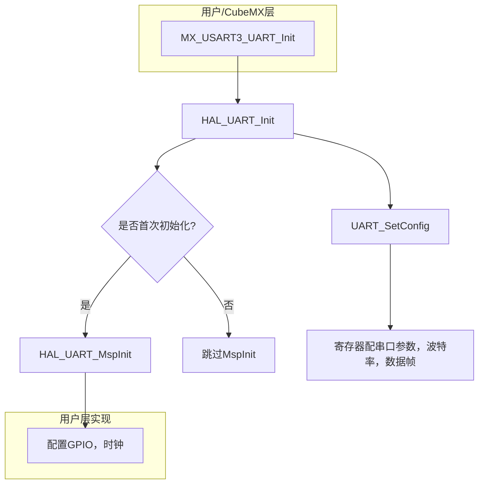
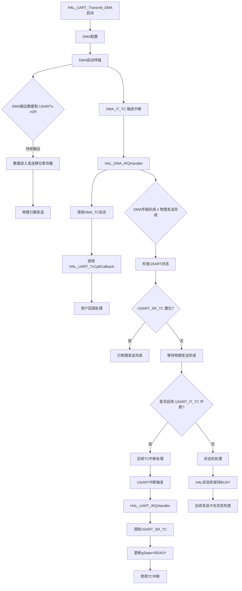

## 一.外设使用

[TOC]

### 1.初始化顺序(以串口为例)

#### 1.1.时钟初始化

- 首先进行IO口时钟初始化

  - **`HAL_UART_MspInit`** 函数的部分代码

  ```c
  __HAL_RCC_USART2_CLK_ENABLE(); // 串口时钟初始化
  __HAL_RCC_GPIOD_CLK_ENABLE(); // GPIO时钟初始化
  ```

- 进行串口初始化的时候要求初始化IO口原因：串口实质是作为IO口的复用,即将IO口连接到硬件外设上面去，所以要将IO口也初始化时钟

- IO引脚复用中，<u>IO口需要配置时钟来访问IO寄存器完成引脚配置</u>

  - 这里的串口时钟和GPIO口的挂载时钟总线可能会出现不一致的情况，但是这里并不影响实际外设的功能，比如下面为串口和GPIO的时钟挂载

  - ```c
    #define __HAL_RCC_USART2_CLK_ENABLE()   do { \
                                            __IO uint32_t tmpreg; \
                                            SET_BIT(RCC->APB1ENR, RCC_APB1ENR_USART2EN);\
                                            /* Delay after an RCC peripheral clock enabling */\
                                            tmpreg = READ_BIT(RCC->APB1ENR, RCC_APB1ENR_USART2EN);\
                                            UNUSED(tmpreg); \
                                          } while(0U)
    #define __HAL_RCC_GPIOD_CLK_ENABLE()   do { \
                                            __IO uint32_t tmpreg; \
                                            SET_BIT(RCC->APB2ENR, RCC_APB2ENR_IOPDEN);\
                                            /* Delay after an RCC peripheral clock enabling */\
                                            tmpreg = READ_BIT(RCC->APB2ENR, RCC_APB2ENR_IOPDEN);\
                                            UNUSED(tmpreg); \
                                          } while(0U)
    ```

  - 分别挂载在APB1和APB2的时钟总线下，实际以串口外设的时钟源为准，GPIO访问寄存器配置完后就完成工作了，不会影响串口的波特率等性能

- 时钟挂载一般需要参考开发手册

#### 1.2.配置复用GPIO

- 配置引脚为复用功能模式（Alternate Function Mode），并指定复用功能编号（比如AF编号)

- 同时作为一个硬件外设，通常会设置一个默认硬件，此时不需要写入寄存器去修改复用其他引脚编号

- STM32的F1里面会有专门的复用寄存器

  - **`HAL_UART_MspInit`** 函数的内部部分实现代码

    ```c
    GPIO_InitStruct.Pin = GPIO_PIN_5;
    GPIO_InitStruct.Mode = GPIO_MODE_AF_PP;       // 设置IO口为复用推挽输出  这里对应TX引脚
    GPIO_InitStruct.Speed = GPIO_SPEED_FREQ_HIGH; // 这个是IO口电平反转的速度，针对波特率来设定 
    HAL_GPIO_Init(GPIOD, &GPIO_InitStruct);       // 将这个IO口的配置信息写入到复用寄存器里面
    
    GPIO_InitStruct.Pin = GPIO_PIN_6;
    GPIO_InitStruct.Mode = GPIO_MODE_INPUT;      // 设置IO口为输入模式，对应RX引脚
    GPIO_InitStruct.Pull = GPIO_NOPULL;			  // 既不上拉也不下拉
    HAL_GPIO_Init(GPIOD, &GPIO_InitStruct);      // 将这个IO口的配置信息写入到复用寄存器里面
    
    __HAL_AFIO_REMAP_USART2_ENABLE();   // F1系列需要使能专门的寄存器来进行复用
    ```

  - 下面为 **`HAL_GPIO_Init`** 内部实现的部分代码

  - ```c
    switch (GPIO_Init->Mode)
    {
        /* If we are configuring the pin in OUTPUT push-pull mode */
        case GPIO_MODE_OUTPUT_PP:
          /* Check the GPIO speed parameter */
          assert_param(IS_GPIO_SPEED(GPIO_Init->Speed));
          config = GPIO_Init->Speed + GPIO_CR_CNF_GP_OUTPUT_PP;
          break;
    }
    ```

  - 根据GPIO的模式来将IO口的速度以及复用引脚编号的寄存器信号写在config里面，然后将config写入寄存器

  - ```c
    /* Apply the new configuration of the pin to the register */
    MODIFY_REG((*configregister), ((GPIO_CRL_MODE0 | GPIO_CRL_CNF0) << registeroffset), (config << registeroffset));
    ```

- 串口配置需要 TX引脚配置推挽输出，能够能主动拉高和拉低电压

- RX引脚需要配置不上拉以及不下拉的状态，此时才能正常通信

#### 1.3.配置串口

- **`MX_USART2_UART_Init`** 函数内部部分代码

```c
huart2.Instance = USART2;
huart2.Init.BaudRate = 1000000;               // 波特率
huart2.Init.WordLength = UART_WORDLENGTH_8B;  // 字节长度
huart2.Init.StopBits = UART_STOPBITS_1;       // 停止位
huart2.Init.Parity = UART_PARITY_NONE;       // 校验方式，这里不采取校验
huart2.Init.Mode = UART_MODE_TX_RX;          // 设置串口的工作模式，同时启用接收和发送
huart2.Init.HwFlowCtl = UART_HWCONTROL_NONE;  // 设置是否启用硬件流方式
huart2.Init.OverSampling = UART_OVERSAMPLING_16;  // 设置过采样方式，分8倍和16倍
if (HAL_UART_Init(&huart2) != HAL_OK)
{
Error_Handler();
}
```

- 过采样方式分为两种，8倍和16倍，F1只支持16倍，与8倍相比，16倍的精度较低，因为采样次数多，所以分布范围较广，容易受到干扰，而8位则不易受到干扰

  - 同时8倍支持的波特率也更加高，波特率公式为：**`f_CLK / (16 × USARTDIV)`**, `f_clk`为时钟源，`USARTDIV`为分频系数，不同的分频系数对应不同的波特率，波特率也通常为8或者16的倍数，不易受干扰

- 硬件流相当于在通信的过程中加入应答机制，发送的时候主动提醒对方需要接收数据，但是一般配置的异步发送模式不会自动配置硬件流，且硬件流需要通信双方都开启，否则无法通信

- 开发过程一般不开启校验，仅能检测单个bit的错误，且大多数串口通信的传感器默认不开启，同时由于每次通信增加一个bit位，间接降低了性能

- **`HAL_UART_Init`** 函数的内部实现

  ```c
  HAL_StatusTypeDef HAL_UART_Init(UART_HandleTypeDef *huart)
  {
    /* Check the UART handle allocation */
    if (huart == NULL)
    {
      return HAL_ERROR;
    }
  
    /* Check the parameters */
    if (huart->Init.HwFlowCtl != UART_HWCONTROL_NONE)
    {
      /* The hardware flow control is available only for USART1, USART2 and USART3 */
      assert_param(IS_UART_HWFLOW_INSTANCE(huart->Instance));
      assert_param(IS_UART_HARDWARE_FLOW_CONTROL(huart->Init.HwFlowCtl));
    }
    else
    {
      assert_param(IS_UART_INSTANCE(huart->Instance));
    }
    assert_param(IS_UART_WORD_LENGTH(huart->Init.WordLength));
  #if defined(USART_CR1_OVER8)
    assert_param(IS_UART_OVERSAMPLING(huart->Init.OverSampling));  // 过采样方式数据检查
  #endif /* USART_CR1_OVER8 */
  
    if (huart->gState == HAL_UART_STATE_RESET)
    {
      /* Allocate lock resource and initialize it */
      huart->Lock = HAL_UNLOCKED;
  
  #if (USE_HAL_UART_REGISTER_CALLBACKS == 1)
      UART_InitCallbacksToDefault(huart);
  
      if (huart->MspInitCallback == NULL)
      {
        huart->MspInitCallback = HAL_UART_MspInit;
      }
  
      /* Init the low level hardware */
      huart->MspInitCallback(huart);
  #else
      /* Init the low level hardware : GPIO, CLOCK */
      HAL_UART_MspInit(huart);
  #endif /* (USE_HAL_UART_REGISTER_CALLBACKS) */
    }
  
    huart->gState = HAL_UART_STATE_BUSY;
  
    /* Disable the peripheral */
    __HAL_UART_DISABLE(huart);
  
    /* Set the UART Communication parameters */
    UART_SetConfig(huart);
  
    /* In asynchronous mode, the following bits must be kept cleared:
       - LINEN and CLKEN bits in the USART_CR2 register,
       - SCEN, HDSEL and IREN  bits in the USART_CR3 register.*/
    CLEAR_BIT(huart->Instance->CR2, (USART_CR2_LINEN | USART_CR2_CLKEN));
    CLEAR_BIT(huart->Instance->CR3, (USART_CR3_SCEN | USART_CR3_HDSEL | USART_CR3_IREN));
  
    /* Enable the peripheral */
    __HAL_UART_ENABLE(huart);
  
    /* Initialize the UART state */
    huart->ErrorCode = HAL_UART_ERROR_NONE;
    huart->gState = HAL_UART_STATE_READY;
    huart->RxState = HAL_UART_STATE_READY;
    huart->RxEventType = HAL_UART_RXEVENT_TC;
  
    return HAL_OK;
  }
  ```

  - **`assert_param`** 这个函数是为了检查写入寄存器数据的合理性

  - 首先检查句柄是否为NULL

  - 判断是否启用硬件流通信

  - 然后检查参数，波特率、数据位、停止位、校验位

  - 检查过采样方式是否为8倍，否则默认16倍

  - 继续判断是否为首次初始化，如果首次初始化会开启锁资源的初始化

    - 在内部判断是否开启中断回调，然后开始调用 **`HAL_UART_MspInit()`** 进行底层硬件初始化，将GPIO的时钟和配置进行初始化，即配合这个串口的复用资源初始化
    - **`huart->gState = HAL_UART_STATE_BUSY;`** 设置 UART 状态为 BUSY，开始初始化
    - **`__HAL_UART_DISABLE(huart);`** 在配置寄存器前先关闭 UART 外设,放置外设干扰
    - **` UART_SetConfig(huart);`** 将预设好的通信参数设置进去

  - 消除不适用的模式，如 LIN、同步模式、IrDA 等

  - 然后使能外设 **`__HAL_UART_ENABLE(huart);`**

  - ```c
    huart->ErrorCode = HAL_UART_ERROR_NONE;
    huart->gState = HAL_UART_STATE_READY;
    huart->RxState = HAL_UART_STATE_READY;
    huart->RxEventType = HAL_UART_RXEVENT_TC;
    ```

    - 设置 UART 当前状态为就绪，错误码为无错误

- **整体的函数设计逻辑为：**

```c
MX_UARTx_UART_Init()  // 应用层初始化
     ↓
HAL_UART_Init()      //  通用外设配置（波特率/数据位/校验位等）
     ↓
   UART_SetConfig()
     ↓
   HAL_UART_MspInit() ← 用户实现  MCU特定的引脚/时钟配置（需用户实现）
```





#### 1.4.串口原理

串口通信（UART，Universal Asynchronous Receiver/Transmitter）是一种异步串行通信协议，核心特点：

- 异步传输：无需时钟信号同步

- 点对点通信：仅需TX（发送）、RX（接收）两根线

- 帧结构传输：数据以固定格式的帧为单位传输

- 波特率同步：通信双方需约定相同的传输速率

串口发送的是一个连续的字节流，我们所设置的串口参数里面包含了数据的位数，一般串口最多支持8位，即一次发送一个字节，通过程序可以连续发送多个字节，最后组成一个字节序列，接收方接收的也是字节序列

### 2.串口DMA

#### 2.1.DMA原理

**DMA：**DMA传输将数据从一个地址空间复制到另一个地址空间，提供在外设和存储器之间或者存储器和存储器之间的高速数据传输。

- "类似于一条高速公路，区别于城市的红绿灯调度"，可以配合外设进行内存的直接搬运，不经过CPU，减少CPU负担
- **传输的四个方向**：<u>外设到内存    内存到外设    内存到内存    外设到外设</u> 

- **主要API：**
  - **`HAL_UART_Transmit_DMA()`**;串口DMA模式发送
  - **`HAL_UART_Receive_IT()`**;串口DMA模式接收
  - **`HAL_UART_DMAPause()`** 暂停串口DMA
  - **`HAL_UART_DMAResume()`**; 恢复串口DMA
  - **`HAL_UART_DMAStop()`**; 结束串口DMA

- **传输速度：**
  - 以**AHB的时钟**总线频率72MHZ为例，传输速度大概在30MB/s

#### 2.2.DMA串口回环代码(详解)

##### 2.2.1.**首先配置串口，这里以1M波特率为例，异步模式**


##### 2.2.2.**配置DMA**


**配置的元素讲解：**

- 首先**配置DMA为正常模式**，同时**还有循环发送模式**，循环模式可以实现DMA寄存器自动装载，每完成一次发送，自动完成DMA传输的寄存器配置，实现高吞吐量的发送，<u>需要考虑循环发送所带来的通道负载，容易影响其他外设的DMA需求，同时需要手动管理缓冲区来进行数据处理</u>，对于小批量数据传输处理起来会显得过于复杂，使用场景更多的时候可以选择配合SPI进行摄像头或者音频数据的传输，而在串口中这种小批量的数据传输使用正常模式即可
  - **正常模式**: **适用于以帧为单位的数据传输，即单次传输**
    - 对于DMA控制器的占用会比较低，传输完让出总线，不同通道的DMA传输的实时性会更强
    - 可以手动实现发送和接收控制，灵活性很高，同时提供多个中断接口方便数据处理，比如空闲任务中断，传输完成中断，这里也是分别适用于接收处理和发送处理
    - 每次发送完会停止，你需要手动开启，重载寄存器
- 这里发送和接收同处于一个DMA控制器，分属不同的通道，**DMA1 Channel 5** 和 **DMA2 Channel 4**
- 传输的**Priority为仲裁优先级**，不同优先级再遇到同一个DMA传输的时候他们访问的优先级也不一样，即高优先级任务实时性更强

- **Increment Address** 为地址指针递增，**`DMA_CCRx`**(状态寄存器)有**MINC**和**PINC**位。
  - **MINC：**控制内存地址是否递增。
  - **PINC ：**控制外设地址是否递增。


- HAL库的 **`HAL_UART_MspInit`** 用户层函数内部的寄存器使能位置(实际**`Cubemx`**直接生成)

  ```c
  hdma_usart1_rx.Init.PeriphInc = DMA_PINC_DISABLE;
  hdma_usart1_rx.Init.MemInc = DMA_MINC_ENABLE;
  hdma_usart1_tx.Init.PeriphInc = DMA_PINC_DISABLE;
  hdma_usart1_tx.Init.MemInc = DMA_MINC_ENABLE;
  ```

- 这里以外设和内存进行DMA传输为例，外设作为固定地址，通常禁止地址指针递增，而内存需要启用递增以便连续访问内存中的数据
- **Data Width** ：为递增的数据大小，F1只支持8位的递增，即逐个字节递增访问

##### 2.2.3.注意需要使能中断


- DMA正常模式本身支持的是**中断处理**分别为

  - 传输完成中断
  - 传输一半中断
  - 传输错误中断
- 这些中断本身只作为仅通知DMA控制器已将数据从内存搬运到UART数据寄存器（**`USARTx->DR`**），但不直接管理UART硬件的发送状态（如移位寄存器是否清空），**`USART_SR_TC`** 为USART 传输完成标志，表示移位寄存器已经清空，所有数据都已经发送出去，此时标志位置位，在不开启串口中断的前提下是没有办法将 **`USART_SR_TC`** 复位的，这样会导致串口的发射状态(**`huart->gState`** )一直处于忙碌状态，此时的现象就是你发送了一次后直接会卡死，在没有中断的前提下你必须通过轮询手动将 **`USART_SR_TC`** 进行复位。
- 在开启中断的条件下，HAL库提供了一个函数 **`HAL_UART_IRQHandler`** 他会处理和管理所有的中断

**实际开启中断的一些开发：** 

- **常用的回调函数**就是依靠此函数来进行调用的，用户实现的回调函数（如 `HAL_UARTEx_RxEventCallback`）是在HAL库**已经处理完硬件中断（包括清除标志位）** 并且确定了需要通知用户的事件，在回调函数中不需要再去清除硬件中断标志位

- 但是在HAL提供的中断处理函数(如里面，很多情况需要自己手动管理标志位，**这里以空闲中断为例**，**我们进入到`HAL_UART_IRQHandler` 内部来观察置位的条件**

- 这是 **`HAL_UART_IRQHandler`** 函数内部关于清除空闲中断标志位的判断

  ```c
  if ((huart->ReceptionType == HAL_UART_RECEPTION_TOIDLE)
        && ((isrflags & USART_SR_IDLE) != 0U)
        && ((cr1its & USART_SR_IDLE) != 0U))
    {
      __HAL_UART_CLEAR_IDLEFLAG(huart);
  ```

- 这里的有一个很**细节**的地方就是 **`huart->ReceptionType == HAL_UART_RECEPTION_TOIDLE`** 

- **我们经常调用的API应该是 `HAL_UART_Receive_IT()` ，但是如果调用这个API你就会不匹配这个条件，此函数不会帮你清除空闲状态的标志位，你必须手动清除，而如果需要自动清除，你应该调用 `HAL_UARTEx_ReceiveToIdle_DMA`这个API，此时在中断处理里面你不需要手动进行置位** 

  - 我的第一次写法

    ```c
    HAL_UART_Receive_DMA(&huart1,rx_buffer,200);//打开DMA接收
    __HAL_UART_ENABLE_IT(&huart1, UART_IT_IDLE); //使能IDLE中断
    ```

  - 事实上调用这个API可以直接一行即可，且后续也无需手动清除标志位

    ```c
    HAL_UARTEx_ReceiveToIdle_DMA(&huart1,rx_buffer,200);//打开DMA接收并自动使能空闲中断
    ```

- **这里的不同API对应不同的中断判断条件其实可以引出一个HAL库的一个设计思路，即在实现高级API的同时保留底层的寄存器操作API，高级API确实好用，但是调试的难度肯定是高于寄存器操作API的**
  - 这里作者推荐使用寄存器操作API，操作过程中不会出现操作寄存器的繁琐，但是也可以帮助你快速理解寄存器，同时方便问题定位和调试 
  
- DMA中断也是必须要使能的，他需要通过中断来通知数据从内存搬运到UART数据寄存器，HAL库可以中断处理里面已经自动将 **`DMA_IT_TC`** 标志位进行了复位，即通过写入**`DMA_IFCR`** 寄存器来清除 **`TCIFx`**、**`TEIFx`** 、**`HTIFx`** ，你可以直接通过回调函数去进行响应的中断处理，或者在**`void DMA1_Channel5_IRQHandler(void)`** 中处理，这里属于是HAL库预留的第三方中断处理入口，对于低级API你需要在里面手动清理标志位，如果调用 **`HAL_UART_Receive_DMA`** 和 **`HAL_UARTEx_ReceiveToIdle_DMA`** ，那么中断处理里面带有的官方中断处理函数**`HAL_DMA_IRQHandler(&hdma_usart1_rx);`** 就会自动完成中断标志位的清除
  - HAL库的中断处理都是依靠API的状态，是一种状态机的思维


##### 2.2.4.代码解析

###### `main.c`代码

```c
#include "stm32f1xx_it.h"
#include "stdio.h"
#include "string.h"

uint8_t rx_buffer[200] = {0};     // 接收缓冲区
extern uint8_t RX_length;         // 有效数据长度
extern uint8_t IDLE_RX_flag;      // 手动定义的中断标志，用于主循环中继续开启DMA接收
extern uint8_t send_buffer[200];  //  定义的发送缓冲区
extern uint8_t BUFFSIZE;	       // 缓冲区大小(字节数)

HAL_UARTEx_ReceiveToIdle_DMA(&huart1,rx_buffer,200);//打开DMA接收
__HAL_UART_ENABLE_IT(&huart1, UART_IT_IDLE); //使能IDLE中断，在中断处理里面需要手动清除标志位
// 如果希望HAL库自动处理标志位，则调用  HAL_UARTEx_ReceiveToIdle_DMA(&huart1,rx_buffer,200);

while (1)  // 主循环
{
if(IDLE_RX_flag == 1)
{    
  IDLE_RX_flag = 0;   // 清除标志位，用于下一次接收数据成功后继续加载DMA接收    
  //HAL_UARTEx_ReceiveToIdle_DMA(&huart1,rx_buffer,BUFFSIZE);  // 调用这个API则不需要手动清除标志位
  HAL_UART_Receive_DMA(&huart1, rx_buffer, BUFFSIZE);    
}
}

```

###### `stm32f1xx_it.c` 代码

```c
#include "stdio.h"
#include "string.h"
#include "stm32f1xx.h"

extern uint8_t rx_buffer[200]; // 接收缓冲区
uint8_t BUFFSIZE = 200;        // 缓冲区大小(字节数)
uint8_t RX_length = 0;        // 实际接收缓冲区中的有效数据长度
uint8_t IDLE_RX_flag = 0;     // 重装载DMA接收的标志位
uint8_t send_buffer[200] = {0}; // 发送缓冲区


void USART1_IRQHandler(void)
{
	uint32_t tmp_flag = 0;    // 定义的标志位用来获取IDLE空闲标志位
	uint32_t temp;           // 用来抓取DMA接收缓冲区中除去接收的数据的剩余缓冲区长度  
	tmp_flag =__HAL_UART_GET_FLAG(&huart1,UART_FLAG_IDLE); //获取IDLE标志位 返回布尔值（SET 或 RESET）。
  	uint32_t error_flags = __HAL_UART_GET_FLAG(&huart1,(UART_FLAG_PE | UART_FLAG_FE | UART_FLAG_NE | UART_FLAG_ORE));  // 抓取所有的DMA接收失败的标志位并且进行处理
  if (error_flags != 0)
  {
       // 这里可以定义你所需要进行的错误处理操作，这里留空
  }
  if((tmp_flag != RESET)) // 检测idle标志被置位
  {
    __HAL_UART_CLEAR_IDLEFLAG(&huart1);//清除空闲标志位  
    //temp = huart1.Instance->SR;  //清除状态寄存器SR,读取SR寄存器可以实现清除SR寄存器的功能
    //temp = huart1.Instance->DR; //读取数据寄存器中的数据
      
     // 内部强行禁止DMA的发送或者接收请求专门为UART通信设计，集成了DMA终止和UART状态管理的完整流程
    HAL_UART_DMAStop(&huart1);   
      
//      HAL_DMA_Abort(&hdma_usart1_rx);   // 这里仅仅是DMA层面的禁用，但是和串口外设关联的  需用户手动管理UART外设的状态（如禁用DMA请求、清理标志等）。UART状态与DMA状态不一致需要处理
      
	temp  =  __HAL_DMA_GET_COUNTER(&hdma_usart1_rx);// 接收DMA接收缓冲区中除去接收的数据的剩余缓冲区长度
	RX_length = (BUFFSIZE - temp);   			   // 接收的有效数据长度，BUFFSIZE为缓冲区的大小
  	memcpy(send_buffer,rx_buffer,RX_length);      // 将接收缓冲区的数据拷贝到发送缓冲区
  	memset(rx_buffer,0,200);                     // 缓冲区清零
  	if(HAL_UART_Transmit_DMA(&huart1,send_buffer,RX_length) == HAL_OK)
  	{
		IDLE_RX_flag = 1;
//        HAL_UARTEx_ReceiveToIdle_DMA(&huart1,rx_buffer,BUFFSIZE);  // 可以直接在这里重装载DMA接收，可选，这里采取主循环标志位判断
  	}
  }
  HAL_UART_IRQHandler(&huart1);   // HAL库的实际中断处理函数
}
```

**`stm32f1xx_it.c` 代码内部深度解析** ：

- **`__HAL_UART_CLEAR_IDLEFLAG(&huart1)`** ，这个函数用来手动清除IDLE空闲中断

  - ```c
    #define __HAL_UART_CLEAR_PEFLAG(__HANDLE__)     \
      do{                                           \
        __IO uint32_t tmpreg = 0x00U;               \
        tmpreg = (__HANDLE__)->Instance->SR;        \
        tmpreg = (__HANDLE__)->Instance->DR;        \
        UNUSED(tmpreg);                             \
      } while(0U)
    ```

  - **这里读取了SR寄存器和DR寄存器用于清除IDLE空闲中断标志位**

    - 在STM32的UART硬件里面，当你读取SR状态寄存器的时候此时代表你已经响应了IDLE标志位，然后读取DR寄存器，通常表示你“读取了”引发事件的那一个字节，即使此时 DR 里没有数据了。这个动作作为清除 IDLE 的“确认”。
    - 不同的标志位对于硬件寄存器读写和清除策略不一样，这里不一一列举了

  - **这里虽然清除了中断标志位，但是不代表下次会立即继续进入空闲中断**，串口的空闲中断是需要在 RX 线接收到数据后，若空闲时间超过 1 个字符时间（1Mbps 下为 10μs）触发。如果触发一次后没有接收到数据，那么也不会继续触发

  - 

  - 

  - **从这个SR状态寄存器里面标志位来解释空闲中断触发原理**

    - **IDLE标志只能被触发一次**：当检测到总线空闲时，IDLE标志置位
    - **需要"解锁"条件**：IDLE标志在下次能被再次置位前，必须满足：
      - 再次收到数据（RXNE置位）
      - 并且再次出现总线空闲

  - ```mermaid
    sequenceDiagram
        participant Bus as UART总线
        participant SR as 状态寄存器(SR)
        participant DR as 数据寄存器(DR)
        
        Note over Bus,DR: 初始状态：总线活动
        Bus->>SR: 发送数据帧
        SR->>SR: RXNE=1 (收到数据)
        DR->>SR: 读取DR后 RXNE=0
        
        Note over Bus,DR: 第一次空闲检测
        Bus->>SR: 总线空闲 >1字节时间
        SR->>SR: IDLE=1 (触发中断)
        SR->>SR: 清除IDLE标志后 IDLE=0
        
        Note over Bus,DR: 锁定状态
        Bus->>SR: 总线再次空闲
        SR->>SR: IDLE仍为0 (不触发)
        
        Note over Bus,DR: 解锁条件
        Bus->>SR: 收到新数据
        SR->>SR: RXNE=1
        DR->>SR: 读取DR后 RXNE=0
        
        Note over Bus,DR: 第二次空闲检测
        Bus->>SR: 总线再次空闲
        SR->>SR: IDLE=1 (可再次触发)
    ```

- **`HAL_UART_DMAStop(&huart1);`** 这个函数用来统一管理，集成了DMA终止和UART状态管理的完整流程，用于中断处理数据

  - 函数内部的代码

    ```c
    HAL_StatusTypeDef HAL_UART_DMAStop(UART_HandleTypeDef *huart)
    {
      uint32_t dmarequest = 0x00U;
      /* The Lock is not implemented on this API to allow the user application
         to call the HAL UART API under callbacks HAL_UART_TxCpltCallback() / HAL_UART_RxCpltCallback():
         when calling HAL_DMA_Abort() API the DMA TX/RX Transfer complete interrupt is generated
         and the correspond call back is executed HAL_UART_TxCpltCallback() / HAL_UART_RxCpltCallback()
         */
    
      /* Stop UART DMA Tx request if ongoing */
      dmarequest = HAL_IS_BIT_SET(huart->Instance->CR3, USART_CR3_DMAT);
      if ((huart->gState == HAL_UART_STATE_BUSY_TX) && dmarequest)
      {
        ATOMIC_CLEAR_BIT(huart->Instance->CR3, USART_CR3_DMAT);
    
        /* Abort the UART DMA Tx channel */
        if (huart->hdmatx != NULL)
        {
          HAL_DMA_Abort(huart->hdmatx);
        }
        UART_EndTxTransfer(huart);
      }
    
      /* Stop UART DMA Rx request if ongoing */
      dmarequest = HAL_IS_BIT_SET(huart->Instance->CR3, USART_CR3_DMAR);
      if ((huart->RxState == HAL_UART_STATE_BUSY_RX) && dmarequest)
      {
        ATOMIC_CLEAR_BIT(huart->Instance->CR3, USART_CR3_DMAR);
    
        /* Abort the UART DMA Rx channel */
        if (huart->hdmarx != NULL)
        {
          HAL_DMA_Abort(huart->hdmarx);
        }
        UART_EndRxTransfer(huart);
      }
    
      return HAL_OK;
    }
    ```

    - ```c
      dmarequest = HAL_IS_BIT_SET(huart->Instance->CR3, USART_CR3_DMAR);
      dmarequest = HAL_IS_BIT_SET(huart->Instance->CR3, USART_CR3_DMAT);
      ```

    - 检查CR3寄存器的 **DMAR** 位和 **DMAT** 位来查看是否正在请求DMA的发送和接收

    - ```c
      ATOMIC_CLEAR_BIT(huart->Instance->CR3, USART_CR3_DMAT);
      ATOMIC_CLEAR_BIT(huart->Instance->CR3, USART_CR3_DMAR);
      ```

    - 如果处于发送或者接收状态，则强制关停，将标志位清除

    - ```c
      ATOMIC_CLEAR_BIT(huart->Instance->CR3, USART_CR3_DMAT);
      ATOMIC_CLEAR_BIT(huart->Instance->CR3, USART_CR3_DMAR);
      ```

    - 然后继续判断DMA是否处于发送或者接收状态,如果是，则关闭该DMA通道

    - ```c
      HAL_DMA_Abort(huart->hdmarx);
      HAL_DMA_Abort(huart->hdmatx);
      ```

    - 然后最后确保关闭UART的硬件发送和接收

    - ```c
      UART_EndTxTransfer(huart);
      UART_EndRxTransfer(huart);
      ```

    - ```mermaid
      flowchart LR
          A[关闭UART的DMA TX/RX请求] --> B[关闭DMA通道]
          
      
          %% DMA标志位
          B --> B1[关闭UART的硬件发送/接收状态]
      ```

    - 这里的关闭是为了保证在接收的数据里面处理的时候数据不要被覆盖了

  - **`HAL_UART_DMAStop(&huart1);`** 函数有点类似一刀切，他在接收的时候把发送也关停了，可能会造成发送缓冲区的数据丢失，解决方法也很简单，用**下面的代码**替换掉 **`HAL_UART_DMAStop(&huart1); `** 函数

  - ```c
    #include "stm32f1xx.h"   
    uint32_t dmarequest = 0x00U;
    dmarequest = HAL_IS_BIT_SET(huart1.Instance->CR3, USART_CR3_DMAR);
    if ((huart1.RxState == HAL_UART_STATE_BUSY_RX) && dmarequest)
    {
      ATOMIC_CLEAR_BIT(huart1.Instance->CR3, USART_CR3_DMAR);
    }
    
    HAL_DMA_Abort(&hdma_usart1_rx); 
    
    ATOMIC_CLEAR_BIT(huart1.Instance->CR1, (USART_CR1_RXNEIE | USART_CR1_PEIE));
    ATOMIC_CLEAR_BIT(huart1.Instance->CR3, USART_CR3_EIE);
    
    if (huart1.ReceptionType == HAL_UART_RECEPTION_TOIDLE)
    {
    ATOMIC_CLEAR_BIT(huart1.Instance->CR1, USART_CR1_IDLEIE);
    }
    
    huart1.RxState = HAL_UART_STATE_READY;
    huart1.ReceptionType = HAL_UART_RECEPTION_STANDARD;
    ```

    - 这里注意添加头文件，否则无法正常调用**ATOMIC_CLEAR_BIT**，这里面代码实际就是将**HAL_UART_DMAStop(&huart1); ** 拆成了两半，但由于HAL库对于内部的一些寄存器操作都采用静态方式，外部文件无法直接调用，所以是深入函数内部，将内部的实现直接照搬出来，上面只对应RX，如果需要TX直接到函数里面找即可

- **`temp  =  __HAL_DMA_GET_COUNTER(&hdma_usart1_rx);`** : 该函数可以读取NDTR寄存器，获取DMA中未传输的数据个数

  - ```c
    #define __HAL_DMA_GET_COUNTER(__HANDLE__) ((__HANDLE__)->Instance->CNDTR)
    ```

  - 寄存器会在重新开启DMA接收的时候指针自动复位，无需手动管理

##### 2.2.5.DMA串口流程总结




#### 3.DMA串口接收实战 

##### 3.1.陀螺仪数据接收处理(不定长帧处理)

- 首先进行HAL库配置，需要对响应串口进行配置，波特率115200，开启中断，中断优先级取决于数据实时性，可以以较高的优先级
- 同时配置定时器中断用于异步打印，这里有个要求就是，**<u>定时器这种固定周期中断的优先级需要低于串口中断</u>** ，因为运用的是串口DMA接收空闲中断，追求强实时性

- 然后进行代码编写

  - **初始化：**

    ```c
      Angle_init();  // 角度追踪初始化，用于处理陀螺仪绝对角度
      HAL_Delay(100);
      //————————————————陀螺仪初始化—————————————————— 
    //  HAL_UART_Transmit_DMA(&huart2,unlock_register,5);  // 解锁
    //  HAL_Delay(230);
    //  HAL_UART_Transmit_DMA(&huart2,Initalxy_correct,5);  // XY轴调零
    //  HAL_Delay(230);
    //  HAL_UART_Transmit_DMA(&huart2,Initalz_correct,5);   // Z轴调零
    //  HAL_Delay(3000);
    //  HAL_UART_Transmit_DMA(&huart2,save_settings,5);     // 保存按钮
      HAL_Delay(200);
      //————————————————陀螺仪初始化—————————————————— 
      
      // 接收必须为44，44代表一共接收44个字节才会停止接收，触发接收完成的空闲中断
      // 这里的44代表为 加速度 + 角度 + 角速度 + 四元数 
      if(HAL_UARTEx_ReceiveToIdle_DMA(&huart2,Receive_data,44)==HAL_OK)   // 开启DMA接收,同时会触发空闲中断，调用回调函数
      {
          
      }
      HAL_Delay(100);
    
      HAL_TIM_Base_Start_IT(&htim3);  // 开启定时器中断
    ```

  - **空闲中断回调数据处理(回调函数无需处理标志位)：**

    ```c
    //——————————————————————————————————DMA数据接收——————————————————————————————————
    uint8_t BUFF_SIZE = 176;   // 接收的缓冲区大小
    uint8_t Receive_data[176] = {0};
    uint8_t RX_aclength= 0;   // 用来接收一次接收的所有数据长度
    //——————————————————————————————————DMA数据接收——————————————————————————————————
    uint8_t time = 0;
    uint8_t all_time = 0;
    
    //——————————————————————————————————中断回调处理——————————————————————————————————
    // 空闲中断回调函数
    void HAL_UARTEx_RxEventCallback(UART_HandleTypeDef *huart, uint16_t Size)
    {
      if(huart == &huart2)  
      {    
        HAL_UART_DMAStop(&huart2);    // 更新DMA计数
        uint32_t tmp_flag = 0;
        uint32_t temp;    
        temp  =  __HAL_DMA_GET_COUNTER(&hdma_usart2_rx);// 接收DMA接收缓冲区中除去接收的数据的剩余缓冲区长度
        RX_aclength = (BUFF_SIZE - temp);    // 接收的有效数据长度(所有的数据加在一起的长度)
        
            // 遍历缓冲区解析所有完整帧
        for(int pos = 0; pos <= RX_aclength - 11 ; )  // 每帧11字节
        { 
          if(Receive_data[pos] == 0x55) // 帧头验证
            {           
              ProcessFrame(&Receive_data[pos]);     // 解析单帧
              pos += 11;                          // 跳至下一帧头
          } else 
          {
              pos++;                              // 搜索帧头
          }
        }
        // 重新开启DMA接收
        HAL_UARTEx_ReceiveToIdle_DMA(&huart2,Receive_data,44);
      }  
    }
    
    // 串口错误中断回调
    void HAL_UART_ErrorCallback(UART_HandleTypeDef *huart)
    {
      printf("send_faild");
    }
    
    //——————————————————————————————————中断回调处理——————————————————————————————————
    ```

  - **完整的结构代码，包含了空闲中断回调函数中对数据帧的解析以及定时器中断：**

    ```c
    //——————————————————————————————————帧结构解析——————————————————————————————————
    
    // 数据解析标志位
    //uint8_t symbol_51 = 0;
    //uint8_t symbol_52 = 0;
    //uint8_t symbol_53 = 0;
    
    // 单帧解析函数，传入接收数据缓冲区
    void ProcessFrame(uint8_t *frame) 
      {
        /* 帧结构确认
         * [0] = 0x55 (帧头)
         * [1] = 类型标识
         * [2-9] = 数据域 低字节在前，高字节在后
         * [10] = 校验和
         */
    //    printf("test:%x\n",frame[1]); 
        // 校验和验证
        uint8_t sum = 0;
        for(int i=0; i<10; i++) sum += frame[i];
        if(sum != frame[10]) return; // 校验失败丢弃，继续处理后续帧
           
        //  根据类型标识分流处理
        switch(frame[1]) { // 关键判断点
            case 0x51: // 加速度
    //            symbol_51 = 1;
                HandleAcceleration(frame);
                break;
                
            case 0x52: // 角速度
    //            symbol_52 = 1;
    
                HandleGyroscope(frame);
                break;
                
            case 0x53: // 欧拉角
              
    //            symbol_53 = 1;
                HandleEulerAngles(frame);
                break;
              
        }
    }
    
    // 结构体实例初始化，全局静态
    JY61P JY61P_Struct = {0.0,0.0,0.0,0.0,0.0,0.0,0.0,0.0,0.0,0.0,0.0,0.0,0.0,0.0,0.0,0.0,0.0};
    // 需要数据直接读取结构体的数据就行
    
    // 加速度处理函数变量
    int16_t acc_x = 0;
    int16_t acc_y = 0;
    int16_t acc_z = 0;
    // 加速度处理函数
    void HandleAcceleration(uint8_t *f) {
        acc_x = (f[3]<<8) | f[2];
        acc_y = (f[5]<<8) | f[4];
        acc_z = (f[7]<<8) | f[6];  
        
        JY61P_Struct.ac_acc_x = (acc_x / 32768.0f) * 16.0f * 9.8f;
        JY61P_Struct.ac_acc_y = (acc_y / 32768.0f) * 16.0f * 9.8f;
        JY61P_Struct.ac_acc_z = (acc_z / 32768.0f) * 16.0f * 9.8f;
    }
    
    
    // 角度处理函数 包含欧拉角和弧度变量
    int16_t roll   = 0;
    int16_t pitch  = 0;
    int16_t yaw    = 0;
    // 角度处理函数 包含欧拉角和弧度
    void HandleEulerAngles(uint8_t *f) {
        roll  = (f[3]<<8) | f[2]; // 横滚角
    
        pitch = (f[5]<<8) | f[4]; // 俯仰角
        yaw   = (f[7]<<8) | f[6]; // 偏航角
      
        // 度
        JY61P_Struct.ac_roll  = (roll / 32768.0f)  * 180.0f;
        JY61P_Struct.ac_pitch = (pitch / 32768.0f) * 180.0f;
        JY61P_Struct.ac_yaw   = (yaw / 32768.0f)   * 180.0f;
        
        // 转化弧度制
        JY61P_Struct.rad_roll  = degrees_to_radians(JY61P_Struct.ac_roll);
        JY61P_Struct.rad_pitch  = degrees_to_radians(JY61P_Struct.ac_pitch);
        JY61P_Struct.rad_yaw    = degrees_to_radians(JY61P_Struct.ac_yaw);  
      
    //    printf("oulajiao:%f\n",JY61P_Struct.ac_roll); 
    }
    
    // 角速度处理函数变量
    int16_t gyro_x =0;
    int16_t gyro_y =0;
    int16_t gyro_z =0;
    
    // 角速度处理函数
    void HandleGyroscope(uint8_t *f) {
        gyro_x  = (f[3]<<8) | f[2]; // 横滚角
        gyro_y = (f[5]<<8) | f[4]; // 俯仰角
        gyro_z   = (f[7]<<8) | f[6]; // 偏航角
        
        // 度
        JY61P_Struct.ac_gyro_x  = gyro_x / 32768.0f * 2000.0f;
        JY61P_Struct.ac_gyro_y  = gyro_y / 32768.0f * 2000.0f;
        JY61P_Struct.ac_gyro_z  = gyro_z / 32768.0f * 2000.0f;
        
    //    printf("%f\n",JY61P_Struct.ac_gyro_z);
        // 转化弧度制
        JY61P_Struct.rad_gyro_x  = degrees_to_radians(JY61P_Struct.ac_gyro_x);
        JY61P_Struct.rad_gyro_y  = degrees_to_radians(JY61P_Struct.ac_gyro_y);
        JY61P_Struct.rad_gyro_z    = degrees_to_radians(JY61P_Struct.ac_gyro_z);  
    }
    
    //——————————————————————————————————帧结构解析——————————————————————————————————
    
    
    //—————————————————————————初始化参数指令——————————————————————————————————————
    
    //     首先解锁后延时200ms  不同数据的校准间隔100ms   然后延时 3s 最后发送保存，保存后延时100ms
    
    // 解锁寄存器  FF AA 69 88 B5      解锁后至少延时200ms
    uint8_t unlock_register[5] = {0xFF, 0xAA, 0x69, 0x88, 0xB5};
    // Z轴角度归零 FF AA 76 00 00 
    uint8_t reset_z_axis[5] = {0xFF, 0xAA, 0x76, 0x00, 0x00};
    //设置200HZ输出 FF AA 03 0B 00
    uint8_t set_output_200Hz[5] = {0xFF, 0xAA, 0x03, 0x0B, 0x00};
    //设置波特率115200 FF AA 04 06 00
    uint8_t set_baudrate_115200[5] = {0xFF, 0xAA, 0x04, 0x06, 0x00};
    // 角度归零校准做参考位置 xy轴的角度归零
    uint8_t Initalxy_correct[5] = {0xFF,0xAA,0x01,0x08,0x00};
    // Z轴角度归零
    uint8_t Initalz_correct [5] = {0xFF,0xAA,0x01,0x04,0x00}; 
    //保存 FF AA 00 00 00 注意在保存前必须要延时三秒
    uint8_t save_settings[5] = {0xFF, 0xAA, 0x00, 0x00, 0x00};
    //—————————————————————————初始化参数指令——————————————————————————————————————
    
    
    //—————————————————————————复位指令——————————————————————————————————————
    
    //重启 FF AA 00 FF 00
    uint8_t restart_device[5] = {0xFF, 0xAA, 0x00, 0xFF, 0x00};
    
    
    //—————————————————————————复位指令——————————————————————————————————————
    
    
    //————————————————————————————————角度和弧度互转——————————————————————————————————————
    // 定义常量：π 和角度到弧度的转换因子
    #define PI 3.14159265358979323846
    #define DEG_TO_RAD (PI / 180.0)
    
    
    // 函数：将 °/s 转换为 rad/s
    float deg_per_sec_to_rad_per_sec(float deg_per_sec) 
    {
        return deg_per_sec * DEG_TO_RAD;
    }
    
    // 函数：将角度（°）转换为弧度（rad）
    float degrees_to_radians(float degrees) 
    {
        return degrees * DEG_TO_RAD;
    }
    
    // 弧度转度数函数
    float rad_to_deg(float rad) 
    {
        return rad * (180.0 / PI);
    }
    
    //————————————————————————————————角度和弧度互转——————————————————————————————————————
    
    
    
    
    
    
    
    //———————————————————————————————角度追踪(基于弧度单位)---------------------------------------------------------------
    
    // 角度追踪结构体初始化，全局静态初始化
    AngleTracker angletracker = {0.0,0.0,0.0};
    
    
    
    
    // 初始化角度跟踪器
    void init_tracker(AngleTracker* tracker, float initial_angle_deg) {
        float initial_rad = initial_angle_deg * (M_PI / 180.0f);  // 度转弧度
        tracker->current_angle_rad = initial_rad;
        tracker->prev_angle_rad = initial_rad;
        tracker->absolute_angle_rad = initial_rad;
    }
    
    // 更新角度跟踪器（输入为度数）
    void update_angle(AngleTracker* tracker, float new_angle_deg) {
        // 验证输入
        if (!isfinite(new_angle_deg) || new_angle_deg < -180.0f || new_angle_deg > 180.0f) {
            fprintf(stderr, "Invalid input angle: %f degrees.\n", new_angle_deg);
            return;
        }
        
        // 转换为弧度
        float new_angle_rad = new_angle_deg * (M_PI / 180.0f);
        
        // 更新角度
        tracker->prev_angle_rad = tracker->current_angle_rad;
        tracker->current_angle_rad = new_angle_rad;
        
        // 计算变化量
        float delta = new_angle_rad - tracker->prev_angle_rad;
        
        // 改进的规范化：处理 C 中 fmod 的负数行为，确保 delta 在 [-M_PI, M_PI)
        delta = fmod(delta, 2.0f * M_PI);
        if (delta > M_PI) {
            delta -= 2.0f * M_PI;
        } else if (delta < -M_PI) {
            delta += 2.0f * M_PI;
        }
        
        // 更新绝对角度
        tracker->absolute_angle_rad += delta;
    }
    
    // 获取规范化角度（[0, 2π)弧度）
    float get_wrapped_angle_rad(const AngleTracker* tracker) {
        float wrapped = fmod(tracker->absolute_angle_rad, 2.0f * M_PI);
        if (wrapped < 0.0f) {
            wrapped += 2.0f * M_PI;
        }
        return wrapped;
    }
    
    // 获取完整旋转圈数
    int get_rotation_count(const AngleTracker* tracker) {
        return (int)round(tracker->absolute_angle_rad / (2.0f * M_PI));
    }
    
    // 获取绝对角度（度数，便于查看）
    float get_absolute_angle_deg(const AngleTracker* tracker) {
        return tracker->absolute_angle_rad * (180.0f / M_PI);
    }
    
    // 初始化函数
    void Angle_init() {
        init_tracker(&angletracker, 0.0f);  // 初始角度0度
    }
    
    
    
    
    //———————————————————————————————角度追踪(基于弧度单位)---------------------------------------------------------------
    
    
    
    //———————————————————————————————定时器中断回调处理角度追踪---------------------------------------------------------------
    
    void HAL_TIM_PeriodElapsedCallback(TIM_HandleTypeDef *htim)
    {
    //  printf("%f,%f\n",JY61P_Struct.ac_yaw,JY61P_Struct.ac_gyro_x);
      if(htim == &htim3)  // 确保中断优先级低于空闲中断的数据采集任务，确保实时性，否则造成数据延迟
      {
       
        // 更新偏航角绝对角度  弧度
        update_angle(&angletracker,JY61P_Struct.ac_yaw);
        // 获取偏航的圈内角度，0到2Π 弧度 
        JY61P_Struct.cycle_yaw = get_wrapped_angle_rad(&angletracker);  
        // 获取偏航的圈内角度，0到360 度
        JY61P_Struct.ac_cycle_yaw = rad_to_deg(JY61P_Struct.cycle_yaw);
        // 更新偏航角绝对角度  度 
        JY61P_Struct.ac_ab_yaw = get_absolute_angle_deg(&angletracker);
        printf("%f\n",JY61P_Struct.ac_cycle_yaw);
      }
      
      
      
    }
    
    
    //———————————————————————————————定时器中断回调处理角度追踪---------------------------------------------------------------
    ```

##### 3.2.DMA传感器多路任务处理策略

- 定时器里面完全可以关闭DMA的数据传输防止数据覆盖，利用 **`HAL_UART_DMAStop`** 函数，或者仅仅关闭接收通道，保证发送通道的畅通
- 熟练使用嵌套式中断，即不只是使用抢占优先级，如果采用第四组优先级方案，不同抢占优先级会进行打断操作，而嵌套优先级允许他们不会相互打断，可以按照子优先级任务执行，提供实时性，推荐采用第三组，响应优先级有0和1个，抢占优先级有7个
- DMA发送中断可以作为你数据处理和准备的标志，减少CPU占用，包括定时器周期中断可以在执行完任务需要写入的时候写入标志位
  - DMA发送操作（如通过I2C DMA写入数据）是异步的，即启动传输后，CPU可立即继续其他任务，而DMA控制器独立处理数据移动。发送中断在DMA计数器达到预设值时触发，通知系统传输已完成，一般发送中断优先级要低于定时器，方便处理如果失败（如超时或总线错误），执行重试或错误处理，可以进行重新发送等操作


### 3.IIC通信

MCU在进行IIC通信时，对于二进制(通常左边为高位，右边为地位)来说，他是高位在前，低位在后传输，标准的IIC通信协议都遵循此标准，而对于通信协议软件层面的高低字节顺序则依照通信协议要求即可.

#### 3.1.主机模式下的使用：

##### 3.1.1.解析函数：轮询函数

- ```c
  uint8_t iic_w = 0x0D;
  HAL_I2C_Mem_Write(&hi2c2,0x04 << 1,0x06,1,&iic_w,1,50)
  ```

  - **这是一个通过IIC写入IIC从机的寄存器地址数据的函数**
  - 0x04 << 1： **`uint16_t DevAddress`** ，对应从机的8位地址
    - 从设备一般都为7位地址，你需要左移一位，读写位直接通过HAL库内部函数处理
  - 0x06 ： **`uint16_t MemAddress`** , 从机寄存器地址(一般寄存器地址为8位)，通常IIC从机需要被写入的时候就可以调用此函数，直接写入对应的寄存器位置
  - 1 ：**`uint16_t MemAddress`** ，从机的寄存器地址字节长度，及这个地址从机预设了多少字节长度，以JY61P陀螺仪为例，有16字节
  - `&iic_w` ： **`pData`** ，需要写入的数据缓冲区地址
  - 1 ：写入的数据字节数
  - 50 ：轮询的最大延迟时间

- ```c
  uint8_t re_data = 0;
  HAL_I2C_Mem_Read(&hi2c2,0x04 << 1,0x06,1,&re_data,1,50)
  ```

  - **这是一个通过IIC读取IIC从机的寄存器数据的函数**
  - 0x04 << 1：**`uint16_t DevAddress`** ,从机的8位地址
  - 0x06 ： **`uint16_t MemAddress`** ，从机寄存器地址，需要读取的寄存器位置
  - 1 ： **`uint16_t MemAddress`** ，从机的寄存器地址字节长度
  - `&re_dat` ： 接收数据缓冲区，用来放置读取的数据
  - 1 ：读取的数据字节数
  - 50 ： 轮询的最大延迟时间

- 解释这里对于地址的字节长度全部设置位16位的原因
  - HAL库兼容7位和10位的寻址模式，常见为7位，正常使用7位地址可以忽略 **`uint16_t`** 这个数据特性，直接给 **`uint8_t`** 就行

- 这里的轮询机制使用起来必须要加上适当延时

##### 3.1.2.解析函数：中断处理

**中断接收：**

- 首先开启中断接收

  ```c
  if(HAL_I2C_Mem_Read_IT(&hi2c2,0x02 << 1 ,0x06 ,1,&re_data,1)==HAL_OK)
  {
    printf("send_successful");
  }
  ```

- 中断回调函数处理

  ```c
  // 读取数据完成后的回调函数可以用来做特殊处理
  void HAL_I2C_MemRxCpltCallback(I2C_HandleTypeDef *hi2c)
  {
    if(hi2c == &hi2c2)
    {
      printf("%x",re_data);
    }
    HAL_I2C_Mem_Read_IT(&hi2c2,0x02 << 1 ,0x06 ,1,&re_data,1);
  }
  
  
  // 错误处理中断
  void HAL_I2C_ErrorCallback(I2C_HandleTypeDef *hi2c)
  {
      uint32_t error = HAL_I2C_GetError(hi2c);
    if (error & HAL_I2C_ERROR_AF) {
      printf("NACK_error");
      // 处理应答失败（NACK）
    } 
    else if (error & HAL_I2C_ERROR_BERR) {
      // 总线错误（如干扰）
      printf("bus_error");
    } 
    else if (error & HAL_I2C_ERROR_ARLO) {
      printf("ar_error");
      // 仲裁丢失（多主竞争）
    } 
    else if (error & HAL_I2C_ERROR_TIMEOUT) {
      printf("over_error");
      
    }
    
  }
  ```

  - 这里的错误中断回调是为了调试不同频率的IIC，防止数据丢失

- 上述的所有函数里面带有 **`Mem`** 的字符代表访问主机访问从机寄存器，仅用于主机模式下的主动发送和读取


##### 3.1.3.解析函数：DMA处理

**DMA接收：**

- DMA进行IIC的接收，如果是使用发送直接改为 **`HAL_I2C_Mem_Write_DMA`** 

  ```c
  if(HAL_I2C_Mem_Read_DMA(&hi2c2,0x02 << 1 ,0x06 ,1,&re_data,1)==HAL_OK)
  {
  printf("send_successful");
  }
  ```

- 如果IIC和UART的DMA触发中断，需同步配置中断优先级（如NVIC），确保与DMA优先级一致。

- 由于IIC和串口不一样，串口为串行，所以可以利用空闲中断来处理不定长的帧，但是IIC有时钟线，他们需要保持数据帧的长度一致

##### 3.1.4.利用DMA进行接收和发送的并发处理

- 首先需要配置收发的DMA，通常情况下需要确保 **`DMATX`**  的优先级高于 **`DMARX`** 


- 我们进行并发处理会依赖DMA的中断，所以中断优先级也需要按照 **`DMA`** 的优先级来处理，我这边采用嵌套优先级，接收的响应优先级落后于发送的响应优先级，不可以进行抢占，我这里是确保并发属性，实际改为抢占优先级也是可以运行的。
- 20ms定时器中断来处理周期任务，可以用来实现 **`IIC`** 的 **`DMATX`** ，并且不干扰 **`DMARX`** 


- 首先设置枚举体用来模拟IIC总线占用情况，同时用标志位来作为收发完成和开启的信号

  ```c
  typedef enum
  {
      I2C_IDLE,      // 空闲
      I2C_READING,   // 读取中
      I2C_WRITING    // 写入中
  } I2C_State_t;
  
  //——————————————标志位————————————————
  // 创建一个枚举示例来作为标志位，初始状态空闲
  volatile I2C_State_t i2c_state = I2C_IDLE;
  // 管理是否进入回调，即是否完成发送或者接收任务
  // 初始化标志位为1，允许立即读取
  volatile uint8_t read_complete = 1;
  volatile uint8_t write_complete = 1;
  // 写入的标志位，可以通过固定中断的任务频率进行写入
  volatile uint8_t write_pending  = 0;
  
  //——————————————标志位————————————————
  
  
  //——————————————地址变量——————————————-
  volatile uint8_t IIC_R = 0x00;    // 读取的数据缓冲区
  volatile uint8_t IIC_W = 0x0B;    // 写入的数据缓冲区
  volatile uint8_t WR_datalen = 1;  // 写入的数据长度   
  volatile uint8_t RE_datalen = 1;  // 读取的数据长度
  volatile uint8_t DEV = 0x02;      // IIC从机地址
  volatile uint8_t DEV_W = 0x06;    // IIC从机寄存器地址
  
  //——————————————地址变量——————————————-
  ```

  - 之类首先将 **`read_complete`** 和 **`write_complete`** 置1，确保读取和接收能够被状态机触发
  - **`write_pending`**  ：这个标志位单独用于写入
  - **`I2C_State_t i2c_state`** ：利用枚举体来进行一些状态判断，**手动模拟IIC总线情况，用发送和接收完成中断配合状态检测**

- 首先在 **`main()`**  函数里面开启接收,并且使能定时器中断

  ```c
  HAL_I2C_Mem_Read_DMA(&hi2c2, DEV << 1, 
                           DEV_W, I2C_MEMADD_SIZE_8BIT, 
                           &IIC_R, RE_datalen);  // 开启IIC的DMA接收
  HAL_TIM_Base_Start_IT(&htim6);  // 使能定时器中断
  ```

  - **`HAL_I2C_Mem_Read_DMA`** ：DMA接收函数
    - **`DEV`**     : 为IIC从机的7位地址，这里手动进行移位处理
    - **`DEV_W`** :  IIC 从机的寄存器地址
    -  **`I2C_MEMADD_SIZE_8BIT`** ：代表8位
    - **`IIC_R`** 读取的数据缓冲区
    - **`RE_datalen`** ： 读取的数据缓冲区长度

- 写状态机函数，这里的状态机放入中断里面，实时性更高

  ```c
  //-------------------------------------------------------------------------------------------------------------------
  // 函数简介     IIC的DMA发送和接收并发处理的状态机函数
  //
  // 参数说明     dev_addr              设备地址，可以传入uint8_t类型，内部会进行移位操作，比如 0x02 << 1  ，所以直接传入7位地址
  // 参数说明     RX_mem_addr           读取的从机的寄存器地址
  // 参数说明     TX_mem_addr           发送的从机的寄存器地址
  // 参数说明     *read_buf             读取数据存放的缓冲区地址
  // 参数说明     read_size            读取数据存放的缓冲区地址大小
  // 参数说明     *write_buf            需要写入的数据缓冲区地址
  // 参数说明     write_size            需要写入的数据缓冲区地址大小
  //
  // 返回参数     
  // 
  // 备注信息    
  //-------------------------------------------------------------------------------------------------------------------
  
  // IIC状态机处理函数（带缓冲区参数）
  void I2C_Process(uint16_t dev_addr, 
                               uint16_t RX_mem_addr, uint16_t TX_mem_addr,
                               uint8_t *read_buf, uint16_t read_size,
                               uint8_t *write_buf, uint16_t write_size)
  {
      // 1. 最高优先级：处理写入请求
      if(write_pending && i2c_state == I2C_IDLE) {
          write_pending = 0;    // 清除请求标志
          write_complete = 0;   // 重置完成标志
          i2c_state = I2C_WRITING;
          
          HAL_I2C_Mem_Write_DMA(&hi2c2, DEV << 1, 
                                TX_mem_addr, I2C_MEMADD_SIZE_8BIT, 
                                write_buf, write_size);
          return;
      }
      
      // 2. 次优先级：处理读取操作
      if(i2c_state == I2C_IDLE && read_complete) {
          read_complete = 0;   // 重置完成标志
          i2c_state = I2C_READING;
          
          HAL_I2C_Mem_Read_DMA(&hi2c2, DEV << 1, 
                               RX_mem_addr, I2C_MEMADD_SIZE_8BIT, 
                               read_buf, read_size);
          return;
      }
  }
  
  // 读取数据完成后的回调函数
  void HAL_I2C_MemRxCpltCallback(I2C_HandleTypeDef *hi2c)
  {
    if(hi2c == &hi2c2)
    {
      printf("%d\n",IIC_R);
      // 此时进入了接收回调，代表读取任务完成
      read_complete = 1;
      // IIC状态此时进入空闲
      i2c_state = I2C_IDLE;
      
      // 立即开始触发状态机
      I2C_Process(DEV,DEV_W,DEV_W,&IIC_R,RE_datalen,&IIC_W,WR_datalen);     
      
    }
    
    
  }
  
  // DMA发送数据完成的回调函数
  void HAL_I2C_MemTxCpltCallback(I2C_HandleTypeDef *hi2c)
  {
    if(hi2c == &hi2c2)
    {
      // 表示发送完成
      write_complete = 1;
      // IIC总线进入空闲阶段
      i2c_state = I2C_IDLE;
      
      // 立即开始触发状态机
      I2C_Process(DEV,DEV_W,DEV_W,&IIC_R,RE_datalen,&IIC_W,WR_datalen);     
      
    }
  }
  
  
  
  // 请求写入操作，这里没有指定任何数据缓冲区，数据写入的缓冲
  void I2C_RequestWrite() {
      write_pending = 1;
      
      // 如果总线空闲，立即触发状态机
      if(i2c_state == I2C_IDLE) {
          I2C_Process(DEV,DEV_W,DEV_W,&IIC_R,RE_datalen,&IIC_W,WR_datalen); 
      }
  }
  ```

  - 这里的逻辑是根据优先级，写的单独优先级会高于读
  - **`i2c_state == I2C_IDLE`** : 这是用来判断总线是否被占用，比如每次读取完需要通过接收完成的中断回调会将 **`i2c_state`** 变为 **`I2C_IDLE`** 
  - **`i2c_state = I2C_WRITING;`** : 状态机里面每次开启DMA发送和接收都会将状态位置位，模拟IIC占线情况，避免数据竞争和无效数据发送，只有当进入DMA发送完成回调和DMA接收完成回调才会释放总线
  - **`HAL_I2C_MemTxCpltCallback`** 和 **`HAL_I2C_MemRxCpltCallback`** 是HAL库的高级回调函数，内部关联了IIC的实际总线情况，而非仅仅是DMA的搬运完成的回调函数

- ```c
  //20MS定时器中断
  void HAL_TIM_PeriodElapsedCallback(TIM_HandleTypeDef *htim)
  {
    if(htim == &htim6)  // 确保中断优先级低于空闲中断的数据采集任务，确保实时性，否则造成数据延迟
    {
      // 写入的缓冲区数据递增，用于检测是否成功写入
      IIC_W++;
      // 超过255就归零
      if(IIC_W >= 0xFF)
      {
        IIC_W = 0x00;
      }
      // 开启一次写入，此类调用会在20ms的周期中断频率来进行，读取则是进行全自动
      I2C_RequestWrite();
    }
  }
  ```

- **如果不需要读取**可以关闭可以采取以下办法，**`main()`** 函数不会调用 **`HAL_I2C_Mem_Read_DMA`** 函数，同时确保 **`read_complete = 0`** 

  ```c
  read_complete = 0
  ```

**`IIC_handle.c` 文件**

```c
typedef enum
{
    I2C_IDLE,      // 空闲
    I2C_READING,   // 读取中
    I2C_WRITING    // 写入中
} I2C_State_t;

//——————————————标志位————————————————
// 创建一个枚举示例来作为标志位，初始状态空闲
volatile I2C_State_t i2c_state = I2C_IDLE;
// 管理是否进入回调，即是否完成发送或者接收任务
// 初始化标志位为1，允许立即读取
volatile uint8_t read_complete = 1;
volatile uint8_t write_complete = 1;
// 写入的标志位，可以通过固定中断的任务频率进行写入
volatile uint8_t write_pending  = 0;

//——————————————标志位————————————————


//——————————————地址变量——————————————-
volatile uint8_t IIC_R = 0x00;    // 读取的数据缓冲区
volatile uint8_t IIC_W = 0x0B;    // 写入的数据缓冲区
volatile uint8_t WR_datalen = 1;  // 写入的数据长度   
volatile uint8_t RE_datalen = 1;  // 读取的数据长度
volatile uint8_t DEV = 0x02;      // IIC从机地址
volatile uint8_t DEV_W = 0x06;    // IIC从机寄存器地址

//——————————————地址变量——————————————-

//-------------------------------------------------------------------------------------------------------------------
// 函数简介     IIC的DMA发送和接收并发处理的状态机函数
//
// 参数说明     dev_addr              设备地址，可以传入uint8_t类型，内部会进行移位操作，比如 0x02 << 1  ，所以直接传入7位地址
// 参数说明     RX_mem_addr           读取的从机的寄存器地址
// 参数说明     TX_mem_addr           发送的从机的寄存器地址
// 参数说明     *read_buf             读取数据存放的缓冲区地址
// 参数说明     read_size            读取数据存放的缓冲区地址大小
// 参数说明     *write_buf            需要写入的数据缓冲区地址
// 参数说明     write_size            需要写入的数据缓冲区地址大小
//
// 返回参数     
// 
// 备注信息    
//-------------------------------------------------------------------------------------------------------------------

// IIC状态机处理函数（带缓冲区参数）
void I2C_Process(uint16_t dev_addr, 
                             uint16_t RX_mem_addr, uint16_t TX_mem_addr,
                             uint8_t *read_buf, uint16_t read_size,
                             uint8_t *write_buf, uint16_t write_size)
{
    // 1. 最高优先级：处理写入请求
    if(write_pending && i2c_state == I2C_IDLE) {
        write_pending = 0;    // 清除请求标志
        write_complete = 0;   // 重置完成标志
        i2c_state = I2C_WRITING;
        
        HAL_I2C_Mem_Write_DMA(&hi2c2, DEV << 1, 
                              TX_mem_addr, I2C_MEMADD_SIZE_8BIT, 
                              write_buf, write_size);
        return;
    }
    
    // 2. 次优先级：处理读取操作
    if(i2c_state == I2C_IDLE && read_complete) {
        read_complete = 0;   // 重置完成标志
        i2c_state = I2C_READING;
        
        HAL_I2C_Mem_Read_DMA(&hi2c2, DEV << 1, 
                             RX_mem_addr, I2C_MEMADD_SIZE_8BIT, 
                             read_buf, read_size);
        return;
    }
}

// 读取数据完成后的回调函数
void HAL_I2C_MemRxCpltCallback(I2C_HandleTypeDef *hi2c)
{
  if(hi2c == &hi2c2)
  {
    printf("%d\n",IIC_R);
    // 此时进入了接收回调，代表读取任务完成
    read_complete = 1;
    // IIC状态此时进入空闲
    i2c_state = I2C_IDLE;
    
    // 立即开始触发状态机
    I2C_Process(DEV,DEV_W,DEV_W,&IIC_R,RE_datalen,&IIC_W,WR_datalen);     
    
  }
  
  
}

// DMA发送数据完成的回调函数
void HAL_I2C_MemTxCpltCallback(I2C_HandleTypeDef *hi2c)
{
  if(hi2c == &hi2c2)
  {
    // 表示发送完成
    write_complete = 1;
    // IIC总线进入空闲阶段
    i2c_state = I2C_IDLE;
    
    // 立即开始触发状态机
    I2C_Process(DEV,DEV_W,DEV_W,&IIC_R,RE_datalen,&IIC_W,WR_datalen);     
    
  }
}


// 请求写入操作，这里没有指定任何数据缓冲区，数据写入的缓冲
void I2C_RequestWrite() {
    write_pending = 1;
    
    // 如果总线空闲，立即触发状态机
    if(i2c_state == I2C_IDLE) {
        I2C_Process(DEV,DEV_W,DEV_W,&IIC_R,RE_datalen,&IIC_W,WR_datalen); 
    }
}

//20MS定时器中断
void HAL_TIM_PeriodElapsedCallback(TIM_HandleTypeDef *htim)
{
  if(htim == &htim6)  // 确保中断优先级低于空闲中断的数据采集任务，确保实时性，否则造成数据延迟
  {
    // 写入的缓冲区数据递增，用于检测是否成功写入
    IIC_W++;
    // 超过255就归零
    if(IIC_W >= 0xFF)
    {
      IIC_W = 0x00;
    }
    // 开启一次写入，此类调用会在20ms的周期中断频率来进行，读取则是进行全自动
    I2C_RequestWrite();
  }
}
```

**`main.c` 文件**

```c
HAL_I2C_Mem_Read_DMA(&hi2c2, DEV << 1, 
                         DEV_W, I2C_MEMADD_SIZE_8BIT, 
                         &IIC_R, RE_datalen);
HAL_TIM_Base_Start_IT(&htim6);
```

 

#### 3.2.上拉电阻

I²C 的 SDA、SCL 线都是 **开漏/开集电极输出**（open-drain/open-collector）

##### 3.2.1.使用场景

**开漏输出** ： MCU内部通常集成了**MOS管**来控制IO口的开关，对于开漏输出，**MOS管**可以开启，控制引脚接地，为低电平，但是如果关闭则会导致引脚悬空(此时引脚的电平进入不确定状态，很显然这样不可靠)，此时内部又加上了一个几十K到几百K的上拉电阻，形成弱上拉(保证MOSFET关闭状态下默认高电平)，此时电流很小，这只适合“保持默认高电平”，不能满足 I²C 高速通信对上升沿的要求。

<u>**如果需要外接上拉电阻，建议关闭MCU或者电子器件的内部上拉**</u>

##### 3.2.2.电路图分析(非IIC标准电路)


- **图片里面没有表示出MCU内部弱上拉的电路图，但是有外部上拉电路图，并且连接一个电子器件，器件内部的阻抗必须远大于外接的上拉电阻，这样能够极大的减小3.3V流到节点的电流，减小电流就能减小电压损耗，此时就可以保证节点的电压保持在接近3.3V，然后作为高阻输入，R2通常是远大于R1的，R2是让输入保持默认高阻状态，即芯片默认关闭，但是R1 才是保证 IO 能真正输出高电平的关键，所以外接一个上拉电阻用来保证能够上拉输出。**

  - 上拉电阻越小 ，上升沿越快（好处），但功耗更大（坏处）。
  - 上拉电阻越大，上升沿越慢，功耗降低，但是如果是IIC快速通讯会导致上升沿速度太慢，信号畸形，通信错误

  - 当内部MOS管打开后，有一个导通电阻(图中未标出)，这个导通电阻非常小，通常为几毫欧到几欧，远小于R2，节点通过低电阻直接接到地，此时电压输出为0，即没有电压经过R2，电子期间不会激活
    - R2就是为了维持输入的高阻态，保证在没有外部驱动的情况下关闭，保持引脚为低电平，即高电平输入来激活电子器件

- **MOS管断开的情况下的电路分析：**

  - **VCC — R1 — 节点 — R2 — GND**（MOS 断开不参与）

  - **这就是一个电阻分压网络，电流为：**

  - $$
    I=  \frac {V_ {CC}}{R_ {1}+R_ {2}}
    $$

  - **节点电压（EN脚电压）为：**

  - $$
    V_{EN} = V_{CC} \cdot \frac{R_2}{R_1 + R_2}
    $$

    

  - **为了让 V_BE接近V_CC，需要 R2≫R1:**

  - $$
    例：𝑉𝐶𝐶=3.3V,𝑅1=10𝑘Ω,𝑅2=100𝑘Ω，VCC​=3.3V,R1​=10kΩ,R2​=100kΩ
    $$

    

  - $$
    I = \frac{3.3}{110k} \approx 30\ \mu A,\quad V_{EN} = 3.3 \cdot \frac{100}{110} \approx 3.0\ \text{V}
    $$

  - 上拉还要“克服”EN脚的**输入漏电流**（设为 I_leak）,MOS 关断时，会有一股很小的直流电流从 VCC 经 R1 → 节点 → R2 → GND 流过，这股电流在节点上形成的分压把节点“抬高”，所以上拉电阻需要考虑到漏电流和抬升的电压

  - $$
    V_{EN} = V_{CC} - I_{pull} \cdot R_1,\quad I_{pull} = I_{leak} + \frac{V_{EN}}{R_2}
    $$

    

  - 只要 I_leak 很小、R_2很大，I_pull  就很小，V_EN就会非常接近V_CC。

    

- **MOS管闭合的情况下的电路分析：**

  - **VCC — R1 — 节点 — MOS(on) — GND** 电流几乎不流向R2，导致R2附近电压全为0

  - **大多数MOS闭环导通的电阻会远小于外接上拉电阻，节点电压结算：**

  - $$
    V_{EN} = V_{CC} \cdot \frac{R_{DS(on)}}{R_1 + R_{DS(on)}} \approx 0
    $$

  - **上拉电流：**

  - $$
    I = \frac{V_{CC}}{R_1 + R_{DS(on)}} \approx \frac{V_{CC}}{R_1}
    $$

  - $$
    R_1 = 10k\Omega ,  R_{DS(on)} = 50\Omega \Rightarrow V_{EN} \approx 16\ \text{mV},\ I \approx 0.33\ \text{mA}
    $$

    

  - 开漏只能“拉低”，**不会主动拉高**。没有 R1，MOS 关断时节点就是悬空（或只被 R2 往地拉）→ 得不到高电平。

  - R2 的作用是“默认下拉，防误使能”；R1 的作用是“当 MOS 关断时提供上拉电流，把节点电压抬到高电平”。两者分工不同。

##### 3.2.3.如何选择上拉电阻的阻值

低电平到高电平的转化在细分的时间刻度下并不是瞬间完成的，它需要有一个爬升的过程，而上拉电阻越大，爬升的越慢，上拉电阻越小，驱动能力越强，爬升的越快，在IIC标准中，**在400KHZ的快速模式下，上升时间 t_r <= 300ns** 


- I²C 总线的信号线（SDA 和 SCL）会受到寄生电容的影响,并且影响高电平的上升速度，高电阻会影响电容的充电速度，这些寄生电容主要来源于：

  - **引脚输入电容**：每个设备的 I²C 引脚都会有一定的输入电容，通常为几 pF 到几十 pF。
  - **PCB 走线电容**：印刷电路板上的走线也会引入电容，通常每厘米约为 1~2 pF。
  - **杜邦线电容**：杜邦线的长度和材质会影响电容，通常每厘米约为 50~100 pF/m。

- 可以根据需要挂载的从机数量以及线束的长度，PCB走线的长度估算出总电容

  - 上拉电阻和寄生电容形成一个 RC 电路，所以可以通过RC电路来计算电平上升时间

  - $$
    t 
    r
    ​
     ≈2.2⋅R 
    p
    ​
     ⋅C 
    total
    ​
    $$

    - $$
      R 
      p
      ​
        是上拉电阻；
      C 
      total
      ​
        是总线电容。
      $$

  - 根据公式来计算所需的上拉电阻

- 一般建议2.7K到4.7k之间能满足20cm走线的400KHZ高速通信

- 示例电路：

  


### 4.SPI通信

​	同步通信协议，不要求主机和从机的速率严格匹配，主设备（Master）负责生成时钟信号（SCLK），而从设备（Slave）只需要根据主设备提供的时钟信号进行数据采样和发送，**<u>主设备的速率不能超过从设备的速率</u>** 

​	引脚为推挽输出，可以主动输出高低电平，无需依赖外部电路，相比于IIC的开漏输出，必须要上拉电阻，电平上升时间低于SPI，所以SPI通常用于高速通信

#### 4.1.通信引脚

##### 4.1.1.协议核心引脚

- **`MISO(Master In Slave out)`**： 主设备输入/从设备输出引脚。该引脚在从模式下发送数据，在主模式下接收数据。
  - **即主设备读取信息需要运用到这个引脚** 
- **`MOSI(Master out Slave In)`**： 主设备输出/从设备输入引脚。该引脚在主模式下发送数据，在从模式下接收数据。
  - **即主设备发送信息需要运用到这个引脚** 
- **从设备的收发引脚：**
  - **`SIMO(Slave In Master out) 和 SOMI(Slave In Master out)`**  和上述引脚功能理解一致，<u>只是主机和从机的表述不一样</u>

- **`SCK(Serial Clock)`** ：串行时钟信号，**主设备通过 SCK 引脚生成时钟信号**，控制数据传输的节奏。从设备根据 SCK 的边沿（上升沿或下降沿）采样或发送数据。
  - 方向：主设备输出，从设备输入
- **`CS/NSS`**：从设备片选信号，由主设备控制。它的功能是用来作为“片选引脚”，引脚为低电平时，表示从设备被选中；当为高电平时，表示从设备未被选中
  - 分为硬件和软件，为了更好管理时序，通常用软件模拟，以匹配所有的从机时序
- **中断引脚(非标准协议)** ： 从设备可以通过一个 GPIO 引脚向主设备发送中断信号，通知主设备某些事件的发生（例如数据准备就绪、错误状态等）。
  - 从设备通过一个 GPIO 引脚输出一个电平变化（通常是低电平有效或高电平有效）来通知主设备。
  - 主设备的相应 GPIO 引脚配置为输入模式，并启用中断功能以检测该信号的变化。

实际使用中，对于一些只需要单方面写入的操作，比如屏幕驱动，可以完全舍弃掉 **`MISO`** 这个引脚，无需接收从机信息


##### 4.1.2.时钟极性和相位

- **CPOL**: 时钟极性，决定了 **`SCK`** 在空闲状态下的电平
  - **CPOL = 0** : 空闲状态下为低电平，决定第一个边沿为上升沿,第二个边沿为下降沿
  - **CPOL = 1** : 空闲状态下为高电平，决定第一个边沿为下降沿,第二个边沿为上升沿
- **CPHA** : 时钟相位，决定了数据在时钟信号的哪个边沿被采样或发送
  - **CPHA = 0** : 数据在时钟信号的第一个边沿被采样
  - **CPHA = 1** : 数据在时钟信号的第二个边沿被采样

**主设备必须根据从设备的要求配置相同的模式。**

#### 4.2.协议使用和解析

##### 4.2.1.主从设备收发

- **SPI是［单主设备（ single-master ）］通信协议，这意味着总线中的只有一支中心设备能发起通信。当SPI主设备想读/写［从设备］时，它首先拉低［从设备］对应的CS/NSS线（低电平有效），接着开始发送工作脉冲到时钟线上，在相应的脉冲时间上，［主设备］把信号发到MOSI实现“写”，或者发送到MISO来实现“读”**

- **SPI主机和从机都有一个串行移位寄存器，主机通过向它的SPI串行寄存器写入一个字节来发起一次传输**
  - 首先拉低对应SS信号线，表示与该设备进行通信
  - 主机通过发送SCLK时钟信号，来告诉从机写数据或者读数据
  - **SCLK时钟信号可以是低电平有效，也可以是高电平有效，**
    - **这里会影响数据采样的边沿即时钟极性(CPOL)决定了上升沿和下降沿位于第一个边沿还是第二个边沿，而时钟相位(CPHA)则决定了通过第一个边沿进行数据采样还是第二个边沿进行数据采样。**
  - 主机(Master)将要发送的数据写到发送数据缓存区(buffer)，缓存区经过移位寄存器(0~7)，串行移位寄存器通过MOSI信号线将字节一位一位的移出去传送给从机，，同时MISO接口接收到的数据拆成BIT位经过**移位寄存器**一位一位的移到接收缓存区。
  - 从机(Slave)也将自己的串行移位寄存器(0~7)中的内容通过MISO信号线返回给主机。同时通过MOSI信号线接收主机发送的数据，这样，两个移位寄存器中的内容就被交换。
  - **SPI虽然是同步通讯协议，但是它的本质仍然是串行通信，通过移位寄存器一位一位发送，但是它可以通过时钟线来进行同步，效率相比异步通信效率更改**
- **主从设备通信需要匹配的几大因素：**
  - **CPHA(时钟相位)**
  - **CPOL(时钟极性)**
  - **MSB/LSB(数据解析顺序)**
  - **主机速率要小于等于从机的速率**


##### 4.2.2.全双工通信协议

**SPI只有主模式和从模式之分，没有读和写的说法，外设的写操作和读操作是同步完成的。如果只进行写操作，主机只需忽略接收到的字节；反之，若主机要读取从机的一个字节，就必须发送一个空字节来引发从机的传输。也就是说，你发一个数据必然会收到一个数据；你要收一个数据必须也要先发一个数据，下图为移位寄存器的收发**


##### 4.2.3.时序图解析


- **CPOL = 1** : 空闲状态下为高电平，决定第一个边沿为下降沿,第二个边沿为上升沿

- **CPHA = 1** : 数据在时钟信号的第**二个边沿被采样**，在这里代表**上升沿进行数据采样**

这里我以**跳变边沿**和**数据采样边沿**来代表时钟周期的两个边沿，具体取决于 **CPOL** 和 **CPHA** 	

- **跳变边沿：** 
  - 主设备会在该边沿将新的数据位驱动到 MOSI 端口。
  - 从设备会在该边沿将新的数据位驱动到 MISO 端口。

- **数据采样边沿** ：
  - 主设备在该边沿采样从设备通过 MISO 发送的数据。
  - 从设备在该边沿采样主设备通过 MOSI 发送的数据。
- **采样时段** ：
  - 在采样边沿和翻转边沿之间的时间段是**采样时段**，在此时段上，这里对于主设备来说，数据已经稳定在 MOSI 和 MISO 端口上，对于从设备而言，数据就是稳定到SOMI和SIMO端口上，本质一样的线路，表述不一样，主设备和从设备可以安全地采样数据，而不会受到信号不稳定的影响。

从这里可以看出，MOSI 和 MISO 端口的状态变化是由时钟信号的跳变边沿和数据采样变样驱动，即从 "空闲状态"到“驱动状态”，代表数据是否填充到对应端口，在时钟信号的跳变沿，MOSI 和 MISO 端口会切换到新的电平值，以表示新的数据位。

**即当主机的输出口（MOSI）输出1bit时，在时钟的采样前沿被从器件输入口（SIMO）采样，而从器件这边，主器件的输入口（MISO）同样是在时钟的采样前沿接收（采样）来自从器件输出口（SOMI）的1bit**

- **时序BIT位分析：**
  - 在MOSI端口，这里每个时钟周期会传输一个bit位，而这个bit位的高低则取决于MOSI的信号电平，高电平则为二进制的1，低电平则为二进制的0
  - 这里观察MOSI端口的时候你可以看到两根线，**一般上面那根线为信号线，下面那根为地线(参考电平)**，主要观察信号线的电平即可，信号线在下则为低电平，在上方则为高电平
  - **数据发送顺序：** 主设备和从设备需要根据相同的传输顺序解析接收到的数据
    - **`MSB`** : 接收到的第一个位被解析为最高有效位（MSB），后续位依次填充到次高有效位、次低有效位，直到最低有效位
    - **`LSB`** : 接收到的第一个位被解析为最低有效位（LSB），后续位依次填充到次低有效位、次高有效位，直到最高有效位


#### 4.3.全双工DMA通讯

```c
const uint8_t data_tx_buf = 0x02;   // 发送的数据缓冲区，这里使用了 const 实际使用可以更改
uint8_t data_len = 1;               // 数据发送长度，发送的字节和接收的字节数是相等的
uint8_t data_rx_buf = 0;            // 接收数据的缓冲区

// 首先拉高IO口的电平，确保初始化不会开启SPI传输
HAL_GPIO_WritePin(GPIOB, GPIO_PIN_12, GPIO_PIN_SET);
HAL_Delay(10);
// 拉低IO口电平，作为时钟片选信号，开启SPI运输
HAL_GPIO_WritePin(GPIOB, GPIO_PIN_12, GPIO_PIN_RESET);
HAL_SPI_TransmitReceive_DMA(&hspi2,&data_tx_buf,&data_rx_buf,data_len);

// 全双工的回调函数，可以由DMA/中断触发,无论接收还是发送都会触发
void HAL_SPI_TxRxCpltCallback(SPI_HandleTypeDef *hspi)
{
  if(hspi == &hspi2)
  {
    printf("%d\n",data_rx_buf);
    // 发送完成就关闭片选信号，可以等待下一次数据传输的片选信号拉低
    HAL_GPIO_WritePin(GPIOB, GPIO_PIN_12, GPIO_PIN_SET); 
  }  
}
```

- **`HAL_SPI_TransmitReceive_DMA(&hspi2,&data_tx_buf,&data_rx_buf,data_len);`** : DMA的收发全双工函数

  - **`data_tx_buf`** : 数据发送缓冲区
  - **`data_rx_buf`** : 数据接收缓冲区
  - **`data_len`** : 数据长度

  - **任何函数开启DMA传输你立刻调用接收数据缓冲区是无法获得返回的数据的，DMA作为数据搬运工，他还需要硬件SPI去进行数据传输，所以需要到回调函数里面去接收这个缓冲区里面更新的数据** 

- **`void HAL_SPI_TxRxCpltCallback(SPI_HandleTypeDef *hspi)`** : 全双工收发的回调函数

  - 通过这里来调用接收缓冲区的更新的数据
  - 在一主多从的情况下，需要断开当前设备的片选信号，你可以拉高当前设备的片选信号，即IO口，切断通讯。
    - **SPI里面一主多从的话无法连续的对多个设备进行操作，必须依靠回调函数来更新每次的片选信号来操作对应的设备**

#### 4.4.剖析SPI全双工函数

```c
HAL_StatusTypeDef HAL_SPI_TransmitReceive_DMA(SPI_HandleTypeDef *hspi, const uint8_t *pTxData, uint8_t *pRxData,uint16_t Size)
{
  uint32_t             tmp_mode;
  HAL_SPI_StateTypeDef tmp_state;

  /* Check rx & tx dma handles */  // 断言检查DMA的句柄配置
  assert_param(IS_SPI_DMA_HANDLE(hspi->hdmarx));
  assert_param(IS_SPI_DMA_HANDLE(hspi->hdmatx));

  /* Check Direction parameter */  // 断言检查当前的方向是否符合配置 全双工(DIRECTION_2LINES)
  assert_param(IS_SPI_DIRECTION_2LINES(hspi->Init.Direction));

  /* Init temporary variables */  // 初始化临时变量来储存当前的SPI模式和状态
  tmp_state           = hspi->State;
  tmp_mode            = hspi->Init.Mode;

  // 检查SPI状态，判断主机为主机 + 双线全双工 + 接收忙的情况下以及处于准备好的状态就不会触发error
  // 硬件上发送完成事件总是先于接收完成事件发生，所以判断是否处于接受忙状态，确保发送处于正常状态
  if (!((tmp_state == HAL_SPI_STATE_READY) ||
        ((tmp_mode == SPI_MODE_MASTER) && (hspi->Init.Direction == SPI_DIRECTION_2LINES) &&
         (tmp_state == HAL_SPI_STATE_BUSY_RX)))) 
  {
    return HAL_BUSY;
  }
  //检查数据缓冲区是否合法，里面必须开辟了地址空间
  if ((pTxData == NULL) || (pRxData == NULL) || (Size == 0U))
  {
    return HAL_ERROR;
  }
  // 对该SPI句柄进行上锁，防止并发访问，导致错误
  /* Process locked */
  __HAL_LOCK(hspi);

  // 如果处于HAL_SPI_STATE_BUSY_RX的状态下后续的回调函数就会不同
  /* Don't overwrite in case of HAL_SPI_STATE_BUSY_RX */
  if (hspi->State != HAL_SPI_STATE_BUSY_RX)
  {
    hspi->State = HAL_SPI_STATE_BUSY_TX_RX;
  }

  /* Set the transaction information */
  hspi->ErrorCode   = HAL_SPI_ERROR_NONE;
  hspi->pTxBuffPtr  = (const uint8_t *)pTxData;
  hspi->TxXferSize  = Size;
  hspi->TxXferCount = Size;
  hspi->pRxBuffPtr  = (uint8_t *)pRxData;
  hspi->RxXferSize  = Size;
  hspi->RxXferCount = Size;

  /* Init field not used in handle to zero */
  hspi->RxISR       = NULL;
  hspi->TxISR       = NULL;

// 判断是否开启CRC校验
#if (USE_SPI_CRC != 0U)
  /* Reset CRC Calculation */
  if (hspi->Init.CRCCalculation == SPI_CRCCALCULATION_ENABLE)
  {
    SPI_RESET_CRC(hspi);
  }
#endif /* USE_SPI_CRC */

  /* Check if we are in Rx only or in Rx/Tx Mode and configure the DMA transfer complete callback */
  if (hspi->State == HAL_SPI_STATE_BUSY_RX) // 如果只是处于接收忙状态，那么就会启用DMA接收的回调函数，而非全双工
  {
    /* Set the SPI Rx DMA Half transfer complete callback */
    hspi->hdmarx->XferHalfCpltCallback = SPI_DMAHalfReceiveCplt;
    hspi->hdmarx->XferCpltCallback     = SPI_DMAReceiveCplt;
  }
  else
  {
    /* Set the SPI Tx/Rx DMA Half transfer complete callback */
    hspi->hdmarx->XferHalfCpltCallback = SPI_DMAHalfTransmitReceiveCplt;
    hspi->hdmarx->XferCpltCallback     = SPI_DMATransmitReceiveCplt;
  }

  /* Set the DMA error callback */  // 设置DMA错误回调函数
  hspi->hdmarx->XferErrorCallback = SPI_DMAError;

  /* Set the DMA AbortCpltCallback */
  hspi->hdmarx->XferAbortCallback = NULL;

  /* Enable the Rx DMA Stream/Channel  */// 启用接收DMA的传输，并且从DR寄存器里面接收的数据通过DMA搬运到接收的数据缓冲区
  if (HAL_OK != HAL_DMA_Start_IT(hspi->hdmarx, (uint32_t)&hspi->Instance->DR, (uint32_t)hspi->pRxBuffPtr,
                                 hspi->RxXferCount))   
  {
    /* Update SPI error code */
    SET_BIT(hspi->ErrorCode, HAL_SPI_ERROR_DMA);  // 将错误码的寄存器的标志位置位
    /* Process Unlocked */
    __HAL_UNLOCK(hspi); // 如果 DMA 接收启动失败，则需要解锁句柄以释放资源，并返回错误状态。
    return HAL_ERROR;
  }

  /* Enable Rx DMA Request */ // 通过寄存器置位，在前面开启DMA的传输的基础上，开启DMA接收，没有上面的操作这里就无法执行
  SET_BIT(hspi->Instance->CR2, SPI_CR2_RXDMAEN);

  /* Set the SPI Tx DMA transfer complete callback as NULL because the communication closing
  is performed in DMA reception complete callback  */
  hspi->hdmatx->XferHalfCpltCallback = NULL;
  hspi->hdmatx->XferCpltCallback     = NULL;
  hspi->hdmatx->XferErrorCallback    = NULL;
  hspi->hdmatx->XferAbortCallback    = NULL;

  /* Enable the Tx DMA Stream/Channel  */ // 启动DMA传输，将发送的数据从缓冲区放入 DR寄存器
  if (HAL_OK != HAL_DMA_Start_IT(hspi->hdmatx, (uint32_t)hspi->pTxBuffPtr, (uint32_t)&hspi->Instance->DR,
                                 hspi->TxXferCount))
  {
    /* Update SPI error code */
    SET_BIT(hspi->ErrorCode, HAL_SPI_ERROR_DMA);   // 将错误码的寄存器的标志位置位
    /* Process Unlocked */
    __HAL_UNLOCK(hspi);  // 如果 DMA 接收启动失败，则需要解锁句柄以释放资源，并返回错误状态。
    return HAL_ERROR;
  }

  /* Check if the SPI is already enabled */  // 通过寄存器标志位判断是否使能SPI传输
  if ((hspi->Instance->CR1 & SPI_CR1_SPE) != SPI_CR1_SPE)
  {
    /* Enable SPI peripheral */
    __HAL_SPI_ENABLE(hspi);
  }

  /* Process Unlocked */
  __HAL_UNLOCK(hspi);

  /* Enable the SPI Error Interrupt Bit */
  __HAL_SPI_ENABLE_IT(hspi, (SPI_IT_ERR));  

  /* Enable Tx DMA Request */  // DMA控制器实际上会帮助SPI自动完成发送
  SET_BIT(hspi->Instance->CR2, SPI_CR2_TXDMAEN);  // 使能DMA发送传输的发送请求，在前面DMA发送通道解锁的基础上

  return HAL_OK;
}
```


##### 4.4.1.初始临时变量来储存当前的SPI模式和状态

```c
tmp_state           = hspi->State;
tmp_mode            = hspi->Init.Mode;
```

- HAL库为 **`State`** 定义了一个枚举体方便状态机调用

- ```c
  typedef enum
  {
    HAL_SPI_STATE_RESET      = 0x00U,    /*!< Peripheral not Initialized                         */
    HAL_SPI_STATE_READY      = 0x01U,    /*!< Peripheral Initialized and ready for use           */
    HAL_SPI_STATE_BUSY       = 0x02U,    /*!< an internal process is ongoing                     */
    HAL_SPI_STATE_BUSY_TX    = 0x03U,    /*!< Data Transmission process is ongoing               */
    HAL_SPI_STATE_BUSY_RX    = 0x04U,    /*!< Data Reception process is ongoing                  */
    HAL_SPI_STATE_BUSY_TX_RX = 0x05U,    /*!< Data Transmission and Reception process is ongoing */
    HAL_SPI_STATE_ERROR      = 0x06U,    /*!< SPI error state                                    */
    HAL_SPI_STATE_ABORT      = 0x07U     /*!< SPI abort is ongoing                               */
  } HAL_SPI_StateTypeDef;
  ```

- 这里第一次调用应该是处于 **`HAL_SPI_STATE_READY`** 状态

##### 4.4.2.判断当前的SPI传输的状态，如果是空闲状态或者接收忙状态都不会触发错误

```c
if (!((tmp_state == HAL_SPI_STATE_READY) ||
    ((tmp_mode == SPI_MODE_MASTER) && (hspi->Init.Direction == SPI_DIRECTION_2LINES) &&
     (tmp_state == HAL_SPI_STATE_BUSY_RX)))) 
{
return HAL_BUSY;
}
```

- 这里的条件判断：**!(A || B)    // 既不是READY，也不是(主机+双线+BUSY_RX)**

  - 只有在 **`A = false`** 且 **`B = false`** 时，**`!(A || B)`** 才为 **`true`**，从而触发 **`if`** 语句
  - 所以它可以处于 **`READY`** 状态或者 **主机 + 双线 + BUSY_RX** 状态就不会触发错误

  - 如果是空闲状态 **`READY`** 后续会自动设置为 **`HAL_SPI_STATE_BUSY_RX`** ,代表可以安全重启发送和接收的DMA

    - 设置状态位

      ```c
      /* Don't overwrite in case of HAL_SPI_STATE_BUSY_RX */
      if (hspi->State != HAL_SPI_STATE_BUSY_RX)
      {
      	hspi->State = HAL_SPI_STATE_BUSY_TX_RX;
      }
      ```

  - 如果状态为 **`HAL_SPI_STATE_BUSY_RX`** 则保持该状态

- **`HAL_SPI_STATE_READY`** 和 **`HAL_SPI_STATE_BUSY_RX`** 两个状态位会在后续有不同的处理

##### 4.4.3.锁住SPI句柄

```c
// 对该SPI句柄进行上锁，防止并发访问，导致错误
/* Process locked */
__HAL_LOCK(hspi);
```

- SPI不支持并发的对于多设备的通信，为了防止资源竞争，开始通讯前会将SPI句柄锁住，不会让其他函数抢占句柄

##### 4.4.4.为SPI的句柄里面的结构体配置相关信息

```c
/* Set the transaction information */
hspi->ErrorCode   = HAL_SPI_ERROR_NONE;
hspi->pTxBuffPtr  = (const uint8_t *)pTxData;
hspi->TxXferSize  = Size;
hspi->TxXferCount = Size;
hspi->pRxBuffPtr  = (uint8_t *)pRxData;
hspi->RxXferSize  = Size;
hspi->RxXferCount = Size;

/* Init field not used in handle to zero */
hspi->RxISR       = NULL;
hspi->TxISR       = NULL;
```

- 将函数传递的参数配置进入结构体

##### 4.4.5.通过宏定义配置CRC校验

```c
// 判断是否开启CRC校验
#if (USE_SPI_CRC != 0U)
  /* Reset CRC Calculation */
  if (hspi->Init.CRCCalculation == SPI_CRCCALCULATION_ENABLE)
  {
    SPI_RESET_CRC(hspi);
  }
#endif /* USE_SPI_CRC */
```

##### 4.4.6.**`HAL_SPI_STATE_READY`** 和 **`HAL_SPI_STATE_BUSY_RX`** 的不同配置的回调函数

```c
if (hspi->State == HAL_SPI_STATE_BUSY_RX) // 如果只是处于接收忙状态，那么就会启用DMA接收的回调函数，而非全双工
{
/* Set the SPI Rx DMA Half transfer complete callback */
hspi->hdmarx->XferHalfCpltCallback = SPI_DMAHalfReceiveCplt;
hspi->hdmarx->XferCpltCallback     = SPI_DMAReceiveCplt;
}
else
{
/* Set the SPI Tx/Rx DMA Half transfer complete callback */
hspi->hdmarx->XferHalfCpltCallback = SPI_DMAHalfTransmitReceiveCplt;
hspi->hdmarx->XferCpltCallback     = SPI_DMATransmitReceiveCplt;
}
```

- <u>在 **`HAL_SPI_STATE_BUSY_RX`** 状态下不会配置标准的回调函数，此回调函数为</u>

  ```c
  static void SPI_DMAReceiveCplt(DMA_HandleTypeDef *hdma)
  {
      // 这里只展示部分重要代码
      
        /* Check if we are in Master RX 2 line mode */
      if ((hspi->Init.Direction == SPI_DIRECTION_2LINES) && (hspi->Init.Mode == SPI_MODE_MASTER))
      {
        /* Disable Rx/Tx DMA Request (done by default to handle the case master rx direction 2 lines) */
        CLEAR_BIT(hspi->Instance->CR2, SPI_CR2_TXDMAEN | SPI_CR2_RXDMAEN);
      }
      else
      {
        /* Normal case */
        CLEAR_BIT(hspi->Instance->CR2, SPI_CR2_RXDMAEN);
      }
  
      
      if (SPI_EndRxTransaction(hspi, SPI_DEFAULT_TIMEOUT, tickstart) != HAL_OK)
      {
        hspi->ErrorCode = HAL_SPI_ERROR_FLAG;
      }
      
      hspi->RxXferCount = 0U; 			 // 计数器清零
      hspi->State = HAL_SPI_STATE_READY;   // 设置状态
      
      HAL_SPI_RxCpltCallback(hspi);  // 调用用户回调函数
  }
  ```

  - 首先判断是不是全双工通讯，且作为主设备，如果是则停止发送(TX)和接收(RX)的DMA请求，如果不是，则仅仅停止接收的DMA请求，**SPI_CR2_TXDMAEN** 和 **SPI_CR2_RXDMAEN** 代表CR2寄存器里面的两个标志位

    

  - 在此状态下调用的回调函数会检查是否结束，并且配置了超时的时间，超时后如果仍然没有接收完成会触发错误编码，**将计数器清零(表示接收数据完成)，并且将状态位从  `HAL_SPI_STATE_BUSY_RX`  重置为 `HAL_SPI_STATE_READY` ，确保下一次SPI传输数据的正常。** 同时数据接收完成最后会调用用户回调函数，让用户能够第一时间获取数据

  - 通常配置DMA为正常模式，所以这里关闭后，会将DMA的资源进行清理，等待下一次的重启，如果配置循环模式会自动重载

- <u>**`HAL_SPI_STATE_READY`** 情况下调用的回调函数为：</u>

  - ```c
    static void SPI_DMATransmitReceiveCplt(DMA_HandleTypeDef *hdma)
    {
        // 这里只展示部分重要代码
        
        if (SPI_EndRxTxTransaction(hspi, SPI_DEFAULT_TIMEOUT, tickstart) != HAL_OK)
        {
          SET_BIT(hspi->ErrorCode, HAL_SPI_ERROR_FLAG);
        }
    
        /* Disable Rx/Tx DMA Request */  // 停止DMA的发送和接收请求
        CLEAR_BIT(hspi->Instance->CR2, SPI_CR2_TXDMAEN | SPI_CR2_RXDMAEN);
    
        hspi->TxXferCount = 0U; // 清零计数器
        hspi->RxXferCount = 0U; // 清零计数器
        hspi->State = HAL_SPI_STATE_READY;   // 设置状态标志位
    }
    
    ```

  - 判断DMA传输是否超时，如果超时会触发错误编码

  - 同时停止发送(TX)和接收(RX)的DMA请求，并且清零发送和接收的计数器，最后将状态位设置为空闲

  - 通常配置DMA为正常模式，所以这里关闭后，会将DMA的资源进行清理，等待下一次的重启，如果配置循环模式会自动重载

- 回调函数本质是SPI经过DMA传输完毕后进行资源清理的必要步骤，最后也包含了用户回调函数，有助于用户第一时间处理数据

##### 4.4.7.启动接收DMA传输

```c
/* Enable the Rx DMA Stream/Channel  */// 启用接收DMA的传输，并且从DR寄存器里面接收的数据通过DMA搬运到接收的数据缓冲区
if (HAL_OK != HAL_DMA_Start_IT(hspi->hdmarx, (uint32_t)&hspi->Instance->DR, (uint32_t)hspi->pRxBuffPtr,
                             hspi->RxXferCount))   
{
/* Update SPI error code */
SET_BIT(hspi->ErrorCode, HAL_SPI_ERROR_DMA);  // 将错误码的寄存器的标志位置位
/* Process Unlocked */
__HAL_UNLOCK(hspi); // 如果 DMA 接收启动失败，则需要解锁句柄以释放资源，并返回错误状态。
return HAL_ERROR;
}
```

- 启用接收DMA的传输，并且从DR寄存器里面接收的数据通过DMA搬运到接收的数据缓冲区
- 如果产生错误则将响应的寄存器标志位置位
- 如果 DMA 接收启动失败，则需要解锁句柄以释放资源，并返回错误状态

##### 4.4.8. 开启SPI的DMA接收

```c
/* Enable Rx DMA Request */ // 通过寄存器置位，在前面开启DMA的传输的基础上，开启DMA接收，没有上面的操作这里就无法执行
SET_BIT(hspi->Instance->CR2, SPI_CR2_RXDMAEN);
```

##### 4.4.9.关闭多余的回调函数

```c
/* Set the SPI Tx DMA transfer complete callback as NULL because the communication closing
is performed in DMA reception complete callback  */
hspi->hdmatx->XferHalfCpltCallback = NULL;
hspi->hdmatx->XferCpltCallback     = NULL;
hspi->hdmatx->XferErrorCallback    = NULL;
hspi->hdmatx->XferAbortCallback    = NULL;
```

- HAL库希望在全双工的函数里面调用的回调函数由一个统一的回调函数来处理，所以关闭多余的回调函数

##### 4.4.10.开启DMA的发送通道，并且使能SPI的DMA传输

```c
/* Enable the Tx DMA Stream/Channel  */ // 启动DMA传输，将发送的数据从缓冲区放入 DR寄存器
if (HAL_OK != HAL_DMA_Start_IT(hspi->hdmatx, (uint32_t)hspi->pTxBuffPtr, (uint32_t)&hspi->Instance->DR,
                             hspi->TxXferCount))
{
/* Update SPI error code */
SET_BIT(hspi->ErrorCode, HAL_SPI_ERROR_DMA);   // 将错误码的寄存器的标志位置位
/* Process Unlocked */
__HAL_UNLOCK(hspi);  // 如果 DMA 接收启动失败，则需要解锁句柄以释放资源，并返回错误状态。
return HAL_ERROR;
}

/* Check if the SPI is already enabled */  // 通过寄存器标志位判断是否使能SPI传输
if ((hspi->Instance->CR1 & SPI_CR1_SPE) != SPI_CR1_SPE)
{
/* Enable SPI peripheral */
__HAL_SPI_ENABLE(hspi);
}
/* Process Unlocked */
__HAL_UNLOCK(hspi);

/* Enable the SPI Error Interrupt Bit */
__HAL_SPI_ENABLE_IT(hspi, (SPI_IT_ERR));  

/* Enable Tx DMA Request */  // DMA控制器实际上会帮助SPI自动完成发送
SET_BIT(hspi->Instance->CR2, SPI_CR2_TXDMAEN);  // 使能DMA发送传输的发送请求，在前面DMA发送通道解锁的基础上
```

- 首先开启发送DMA传输，将发送的数据缓冲区地址和需要放入的发送数据寄存器地址配置进去
- 解锁句柄，避免死锁
- **然后不是立刻开启SPI的DMA发送，而是进行检查SPI外设是否正常，然后解锁句柄，启用错误中断，最后才是开启SPI的DMA发送**
  - 与接收不同，SPI 外设需要主动向 DMA 控制器发出请求，通知其将数据从用户缓冲区写入到 SPI 数据寄存器（DR）,如果SPI外设未启用就会导致发送失败

- **SPI外设寄存器**


#### 4.5.函数设计特点

##### 4.5.1.接收忙状态处理

- **在SPI全双工通信中：**发送和接收是同步进行的，每个时钟周期同时发送1位和接收1位

- **接收缓冲区依赖发送时钟**：从设备只能在主设备提供的时钟边沿返回数据

- **发送完成先于接收完成**：

  - 主设备发送完最后一个字节后，仍需额外时钟周期才能接收完整的响应数据
  - 发送寄存器空标志(TXE)置位 ≠ 接收寄存器非空标志(RXNE)置位
  - 硬件上**发送完成事件总是先于接收完成事件**发生

- **发送完成先于接收可能会导致下一次启用的时候出现接收忙的状态**，此时HAL库会对两种状态进行处理

  - 第一种：空闲状态(`HAL_SPI_STATE_READY`)
  - 第二种：接收忙状态(`HAL_SPI_STATE_BUSY_RX`)，此时代表DMA接收还未完成

  - 如果处于第二种，则不会覆盖，保持该状态，如果第一种代表正常状态，会正常进行DMA的发送和接收更新

    ```mermaid
    graph TD
        A[状态检查] --> B{状态?}
        B -->|READY| C[设为BUSY_TX_RX]
        B -->|BUSY_RX| D[保持BUSY_RX]
        C --> E[配置标准回调]
        D --> F[配置链式回调-普通接收回调]
        E --> G[启动DMA传输]
        F --> G
    ```

- 标准回调函数(**`SPI_DMATransmitReceiveCplt`**)中会进行同时停止发送(TX)和接收(RX)的DMA请求，并且清零发送和接收的计数器，最后将状态位设置为空闲，此时SPI的时钟信号断开，不可以接收和发送数据，需要手动开启，重新调用 **`HAL_SPI_TransmitReceive_DMA`** 即可

- 链式回调函数( **`SPI_DMAReceiveCplt`** )中，也同样停止发送(TX)和接收(RX)的DMA请求，但是只清零接收的计数器，保留发送的计数器，此时你调用 **`HAL_SPI_TransmitReceive_DMA`** **可以重新维持时钟信号**，**<u>保持旧的任务从之前中断的地方继续运行，新的任务和旧的任务是独立的，不会互相影响</u>**

  - 所以在 **`SPI_DMAReceiveCplt`** 里面的用户回调函数可以放心处理完整的旧数据
  - 但是如果新的DMA接收任务和旧任务，它们的数据缓冲区一致会出现硬件冲突，但是实际上DMA启动函数内置了安全处理，在DMA传输的时候会返回BUSY状态，所以不会造成数据冲突，偶发性的碰上状态忙事件，仍然可以调用全双工函数恢复，并且恢复事件更快

##### 4.5.2.接收DMA和发送DMA的开启顺序

- SPI时钟由主机产生，接收需要时钟边沿采样数据，必须等待发送的时钟，所以优先配置接收的DMA，此时只需要等待时钟信号即可捕获数据，所以优先配置好接收DMA能够确保在第一个数据发送时接收DMA已准备好捕获返回数据

- 如果先启动发送DMA：
  - 数据开始发送，接收端会立即返回数据，但接收DMA未准备，直接导致数据丢失。

### 5.寄存器数据位封装(以SPI为例)

**这里全部以HAL库对于SPI的封装来剖析，相关代码文件：**
**`stm32f103xe.h`** : 用来封装宏定义的寄存器位掩码
**`stm32f1xx_hal_spi.c`** ：HAL库对于SPI的驱动
**`spi.c`** : CUBEMX用户初始化的代码

#### 5.1.宏定义计算掩码

```c
#define SPI_CR1_CPHA_Pos                    (0U)                               
#define SPI_CR1_CPHA_Msk                    (0x1UL << SPI_CR1_CPHA_Pos)         /*!< 0x00000001 */
#define SPI_CR1_CPHA                        SPI_CR1_CPHA_Msk                   /*!< Clock Phase */
```

- **`SPI_CR1_CPHA_Pos`** ：为需要控制的寄存器相关处理的位
- **`SPI_CR1_CPHA_Msk`** : 掩码，一个寄存器通常有多个位，每个位的功能不一样，所以操作时只需要对寄存器的某一个位操作即可，所以这个掩码就表示仅针对该位的数据，过滤其他位
- **`SPI_CR1_CPHA`** ： 即为CR1(寄存器)的第零位(0u)的数据，这里为置1


#### 5.2.HAL库对于该掩码的使用

```c
  /* Configure : SPI Mode, Communication Mode, Data size, Clock polarity and phase, NSS management,
  Communication speed, First bit and CRC calculation state */
  WRITE_REG(hspi->Instance->CR1, ((hspi->Init.Mode & (SPI_CR1_MSTR | SPI_CR1_SSI)) |
                                  (hspi->Init.Direction & (SPI_CR1_RXONLY | SPI_CR1_BIDIMODE)) |
                                  (hspi->Init.DataSize & SPI_CR1_DFF) |
                                  (hspi->Init.CLKPolarity & SPI_CR1_CPOL) |
                                  (hspi->Init.CLKPhase & SPI_CR1_CPHA) |
                                  (hspi->Init.NSS & SPI_CR1_SSM) |
                                  (hspi->Init.BaudRatePrescaler & SPI_CR1_BR_Msk) |
                                  (hspi->Init.FirstBit  & SPI_CR1_LSBFIRST) |
                                  (hspi->Init.CRCCalculation & SPI_CR1_CRCEN)));

  /* Configure : NSS management */
  WRITE_REG(hspi->Instance->CR2, ((hspi->Init.NSS >> 16U) & SPI_CR2_SSOE));
```

- 通过按位与( &)的操作，保留 **`hspi->Init.CLKPhase`** 中与 **`CPHA`** 对应的值，这里为 0 或 1

- **将对应的位赋值后，再通过按位或(|)来将该位的值合并到寄存器CR1上**

- ```c
  #define SPI_PHASE_1EDGE                 (0x00000000U)
  #define SPI_PHASE_2EDGE                 SPI_CR1_CPHA
  hspi2.Init.CLKPhase = SPI_PHASE_1EDGE;
  ```

  - 这里表示 **`CLKPhase`** 置1，即数据采样从第二个时钟边沿开始。

#### 5.3.按位或和按位与的使用逻辑

- 按位与(&) ： 对两个数的每一位进行逻辑与操作，只有当对应位均为 1 时，结果为 1，否则为 0
  - 用来提取目标位的值，将不需要的位设为0

- 按位或(|) ： 对两个数的每一位进行逻辑或操作，只要对应位有一个为 1，结果就为 1
  - 将目标位设为 1，而不影响其他位，然后合并配置，将多个位的配置组合到一个寄存器中。

#### 5.4.STM32的寄存器数据位格式

**对于寄存器的每一位都只会设置0或者1，如果需要表示3，则需要两个位一起来表示，为 11**

- **STM32为32位的，所以寄存器的值也应该是32位的(32个二进制)，所以为0x00000000U,即8个零，8个16进制的单位可以表示一个32位进制的单位，U表示无符号**
  - **每个16进制可以表示4位二进制，如果是8个16进制，那么可以表示为 32(4*8)位的二进制数据**
  - 虽然16进制不直观，但是非常紧凑和高效，可以直接对16进制的数据进行按位与(|)或者按位或(&)操作

#### 5.5.解析

```c
// 特定位的掩码
#define SPI_CR1_MSTR_Pos                    (2U)                               
#define SPI_CR1_MSTR_Msk                    (0x1UL << SPI_CR1_MSTR_Pos)         /*!< 0x00000004 */
#define SPI_CR1_MSTR                        SPI_CR1_MSTR_Msk                   /*!< Master Selection */
//特定位的掩码
#define SPI_CR1_SSI_Pos                     (8U)                               
#define SPI_CR1_SSI_Msk                     (0x1UL << SPI_CR1_SSI_Pos)          /*!< 0x00000100 */
#define SPI_CR1_SSI                         SPI_CR1_SSI_Msk                    /*!< Internal slave select */

// 主机和从机的位
#define SPI_MODE_SLAVE                  (0x00000000U)
#define SPI_MODE_MASTER                 (SPI_CR1_MSTR | SPI_CR1_SSI)

//———————————————————————— 展示的部分HAL库内部驱动———————————stm32f1xx_hal_spi.c文件——————————————
WRITE_REG(hspi->Instance->CR1, ((hspi->Init.Mode & (SPI_CR1_MSTR | SPI_CR1_SSI)) |
                              (hspi->Init.Direction & (SPI_CR1_RXONLY | SPI_CR1_BIDIMODE)) |
                              (hspi->Init.DataSize & SPI_CR1_DFF) |
                              (hspi->Init.CLKPolarity & SPI_CR1_CPOL) |
                              (hspi->Init.CLKPhase & SPI_CR1_CPHA) |
                              (hspi->Init.NSS & SPI_CR1_SSM) |
                              (hspi->Init.BaudRatePrescaler & SPI_CR1_BR_Msk) |
                              (hspi->Init.FirstBit  & SPI_CR1_LSBFIRST) |
                              (hspi->Init.CRCCalculation & SPI_CR1_CRCEN)));

/* Configure : NSS management */
WRITE_REG(hspi->Instance->CR2, ((hspi->Init.NSS >> 16U) & SPI_CR2_SSOE)); 
//———————————————————————— 展示的部分HAL库内部驱动———————————stm32f1xx_hal_spi.c文件——————————————
hspi2.Init.Mode = SPI_MODE_MASTER  // 用户HAL库进行初始化的值，由用户选择主机还是从机
```


- **`SPI_CR1_MSTR_Pos`** 和 **`SPI_CR1_SSI_Pos`** 分别代表寄存器的**第二位**和**第八位**

- **`SPI_CR1_MSTR_Msk`** ：**MSTR掩码**，**`SPI_CR1_MSTR_Pos`** 为00......0001(二进制表示法，实际有32位，这里省略)，左移两位为：00......0100(二进制表示法)，即0x00000004(16进制表示法)，这里用位移操作来表示掩码需要联想到按位或的逻辑原理(<u>**移位是为了按位与**</u>)，对两个数的每一位进行逻辑与操作，只有当对应位均为 1 时，结果为 1，否则为 0，所以你需要操作哪一位，通过左移操作，移动到对应位置就行。

- **`SPI_CR1_SSI_Msk`** : **SSI掩码**，左移了8位，所以为 00......0100000000(二进制表示法)，即 0x00000100(16进制表示法)

- **`SPI_CR1_MSTR | SPI_CR1_SSI`** : 确保`MSTR` 和 `SSI` 同时置1来开启主机模式

  - `SPI_CR1_MSTR = 0x00000004`（二进制 `0b0000...0100`）
  - `SPI_CR1_SSI = 0x00000080`（二进制 `0b0000...10000000`） 按位或之后为 ： <u>0x00000084</u>
  - 通过按位或操作，能够确保对应的`MSTR` 和 `SSI` 的寄存器位值置1，**按位或原理：**对两个数的每一位进行逻辑或操作，只要对应位有一个为 1，结果就为 1

- ```c
  #define SPI_MODE_SLAVE                  (0x00000000U)
  #define SPI_MODE_MASTER                 (SPI_CR1_MSTR | SPI_CR1_SSI)
  // 截取的部分驱动代码
  WRITE_REG(hspi->Instance->CR1, ((hspi->Init.Mode & (SPI_CR1_MSTR | SPI_CR1_SSI)) |
  ```

  - 前面我提到了移位是为了按位与，如果两个相同的数据进行按位与，那么这个数据不会变，所以这里面HAL库提供了主机和从机的两个宏定义，`hspi->Init.Mode` 可以配置为 `SPI_MODE_SLAVE` 或者 `SPI_MODE_MASTER` ，如果是 `SPI_MODE_SLAVE` 那么经过按位与操作，对应位没有都为1的情况下为0，此时寄存器中 `MSTR` 和 `SSI` 两个位都置0，此时为从机状态

  

### 6.ADC采集

**将连续变化的模拟信号（如电压、电流等）转换为离散的数字信号**

#### 6.1.采集步骤和周期计算


- **采样：**固定的时间间隔内对模拟信号进行测量，获取其瞬时值，这里的时间间隔就是你的采样周期
  - 采样时间为1.5个周期，PCLK2=72MHz，且ADCCLK为APB2的6分频，即12MHz，则总的转换时间=（1.5+12.5）/12MHz=1.17us|
  - 1.5个周期循环为用户设置，对于F103这是最短周期，用户可以设置更长的周期循环
  - 12.5是固定转换时间，受限于ADC的性能
  - 12MHZ是分频后的时钟频率

| 参数               | STM32F103          | STM32F407          |
| ------------------ | ------------------ | ------------------ |
| **PCLK2 最大频率** | 72 MHz             | 84 MHz             |
| **ADCCLK 分频**    | 2/4/6/8            | 2/4/6/8            |
| **采样时间范围**   | 1.5~239.5 周期     | 3~480 周期         |
| **固定转换时间**   | 12.5 周期（12位）  | 12.5 周期（12位）  |
| **最小转换时间**   | 1.17 μs（72MHz/6） | 1.11 μs（84MHz/6） |

- **量化：**将采样得到的连续幅值映射到有限个离散值
  - 12位ADC可以将输入电压分为 2^12=4096 个等级。
- **编码：**如果ADC的分辨率为12位，则输出的数字代码范围为 0∼4095 

#### 6.2.**ADC采集的不同通道：**

- 注入通道：优先级高，在多个ADC通道的情况下，注入通道优于规则通道优先触发，可以适用于电池掉电检测，触发可以是外部硬件触发也可以是软件触发(HAL库的软件设计)，每个注入通道都有自己独立的寄存器，不会出现数据覆盖的情况，
- 规则通道：使用方式相同，但是所有规则通道都共享一个ADC模块的寄存器，优先级较注入通道低

#### 6.3.**电池掉电检测：**

- 注入通道，设置中断触发，高频中断仅仅用来采集数据，优先级需要权衡，可以适当提高保证掉电检测的敏捷，且数据保存是一次性任务，一般情况下中断只会读取电池电压来比较当前是否处于掉电状态(需要进行测试，测试电机运行中，电压是否会一直波动，波动幅度多大，掉电情况下能否捕捉)


### 7.手动清除错误标志位的作用和意义

在实际通讯过程中会出现在同一地线里面的各个通讯设备，里面会有单个设备因为问题重启，这样会导致通讯直接进入错误状态，而使用HAL库由于内部的高封装性，可能会直接了当的任务API里面封装了类似处理，但是实际上很多情况都需要手动清除标志位，比如说串口DMA，由于一端通讯异常进入复位状态。

- K230复位后重新启动并发送数据时，可能由于串口初始化不完全或复位后的数据格式问题（如丢失位、帧错误等），导致F407无法正确解析数据，接收到不规范的数据后，F407串口可能会触发溢出错误（`ORE`）、帧错误（`FE`）或噪声错误（`NE`），这会使串口进入错误状态。DMA通过串口的错误标志或状态中断来控制数据接收。如果串口处于错误状态（如溢出、帧错误等），DMA不会继续接收数据，导致通信卡死。

#### 7.1串口DMA的通讯错误手动清除

```c

// 串口错误中断，解锁被锁死的DMA串口
void HAL_UART_ErrorCallback(UART_HandleTypeDef *huart)
{
    if (huart->Instance == USART3)
    {
        uint32_t err = huart->ErrorCode;
//        printf("UART3 Error: 0x%08lX\r\n", err); // 打印错误码
        // 清除 ORE
        if (__HAL_UART_GET_FLAG(huart, UART_FLAG_ORE))
        {
            __HAL_UART_CLEAR_OREFLAG(huart);
        }

        // 清除 FE/NE/PE
        if (__HAL_UART_GET_FLAG(huart, UART_FLAG_FE | UART_FLAG_NE | UART_FLAG_PE))
        {
            volatile uint32_t tmp_sr = huart->Instance->SR;
            volatile uint32_t tmp_dr = huart->Instance->DR;
            UNUSED(tmp_sr); UNUSED(tmp_dr);  // #define UNUSED(x) ((void)(x))
        }

        RE_left_uart3();
    }
}
```

- ```
  if (__HAL_UART_GET_FLAG(huart, UART_FLAG_ORE))
  {
      __HAL_UART_CLEAR_OREFLAG(huart);
  }
  ```

  - 检测是否触发了ORE溢出中断，如果触发了就清除标志位，恢复通信

- ```c
  __HAL_UART_GET_FLAG(huart, UART_FLAG_FE | UART_FLAG_NE | UART_FLAG_PE)
  ```

  - 检测帧错误和噪声错误以及奇偶校验错误是否触发了，如果触发就读取SR和DR寄存器来消除标志位，注意顺序不能错
  - **`FE(Framing Error)`**  ：帧错误
  - **`NE(Noise Error)`** : 噪声错误
  - **`PE(**Parity Error)`** : 奇偶校验错误


- 

  ```c
  volatile uint32_t tmp_sr = huart->Instance->SR;
  volatile uint32_t tmp_dr = huart->Instance->DR;
  ```

  - 读取寄存器，**读取 UART 的状态寄存器（SR）和数据寄存器（DR）**。根据 STM32 参考手册，**读取 DR 会自动清除某些错误标志（如 FE、NE、PE）**，但前提是必须先读 SR，再读 DR（顺序很重要）

- ```c
  UNUSED(tmp_sr); UNUSED(tmp_dr);  // #define UNUSED(x) ((void)(x))
  ```

  - 消除警告，告诉编译器，这里的变量不使用，不用警告


